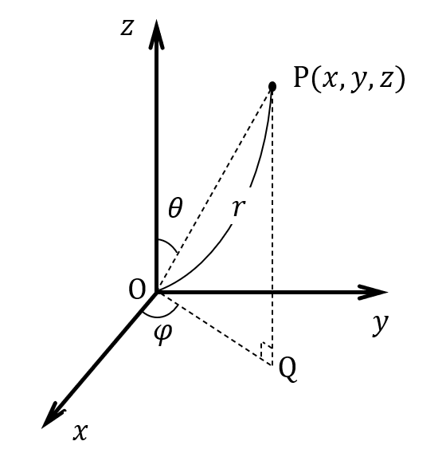

= MOSS-FW Arithmetic Processing Library Specification
Copyright 2023 Sony Semiconductor Solutions Corporatation
v1.0.0, 2023-03-07
:sectnums:
:toc:
:table-caption: Table
:figure-caption: figure
:stem:
:doctype: book
:mathematical-format: svg
:scripts: cjk
:pdf-theme: sensorlib_theme.yml
:chapter-signifier:
:xrefstyle: short
:toc-title: Table of Contents
:chapter-refsig: Chapter
:section-refsig:
:appendix-caption: Appendix
:appendix-refsig: Appendix
:toclevels: 4
:sectnumlevels: 4
:docinfo: shared
:data-uri:

== Summary

=== Purpose

This paper describes the SensorLIB Argo signal processing function specifications.
Up to chapter 3, we describe the behavior from the outside.
Chapter 5 and later describe the API.

=== License

All the source code, including documentation, is licensed under the Apache License, Version 2.0.

=== Possible Readers

<<tableid_reader>> lists the probable readers of this book.

[#tableid_reader]
[cols="1,2"]
.Possible readers
|===
|Reader |Description

|Application creator
|A person who creates applications using sensors such as IMUs
|===

=== Notation

<<tableid_description>> lists the notations used in this manual.

[#tableid_description]
[cols="1,2"]
.List of notations
|===
|Notation |Description

|FIXME
|Indicates that listed specifications will change

|TODO
|indicates that it will be described later

|NOTE
|Show information

|IMPORTANT
|Show important information
|===

=== Definitions and Abbreviations

<<tableid_efinition>> <<tableid_General>> provides a list of definitions and abbreviations used in this document.

[#tableid_efinition]
[cols="1,3"]
.List of project-specific definitions and abbreviations
|===
|Notation |Description

|len
|length

|num
|number

|param
|parameter, parameters

|rot
|rotation
|===

[#tableid_General]
[cols="1,4"]
.List of General Terms
|===
|Notation |Description

|IMU
|inertial measurement unit

|API
|Application Programming Interface
|===

=== Related Documents

<<tableid_RelatedText>> contains related text from this book.

[#tableid_RelatedText]
[cols="3,1,1,1"]
.Related Articles
|===
|Sentence name |Abbreviation |Association type |Description

|SensorLIB Requirements Document
|None
|
|

|SensorLIB Framework Feature Specification
|
|
|
|===

== System configuration

=== SW Configuration

SensorLIB Argo signal processing is a software library that takes sensor data such as IMUs as input and the data processed on that data as output. It is hardware and OS independent. However, in some execution environments, SensorLIB Argo signal processing may call another library for speed.
It can also be used with this library alone, but is intended to be used within the SensorLIB Framework.

SW configuration for use within SensorLIB Framework

Frameworks
[#graphid_framework]
[graphviz, format=svg, align=center]
--
digraph framework {
    rankdir=LR
    compound=true
    sensor0 [shape=box, 
    label="Sensor"]
    sensor1 [shape=box, 
    label="Sensor"]
    output [shape=box, label="Application"]
    subgraph cluster0 {
            in0 [shape=box, 
            label="Component"]
            in1 [shape=box, 
            label="Component"]
            op0 [shape=box, label="Component"]
        in0 -> op0
        in1 -> op0
        style=rounded;
        label="Framework";
    }
    sensor0 -> in0;
    sensor1 -> in1;
    op0 -> output;
}
--
Component internal structure
[#graphid_component]
[graphviz, format=svg, align=center]
SW configuration for use within the .SensorLIB Framework
--
digraph component {
    rankdir=LR
    compound=true
    subgraph cluster1 {
            in2 [shape=box, 
            label="Input Interface"]
            lib [shape=box, 
            label="SensorLIB Argo Signal Processing"]
            output2 [shape=box, label="Output Interface"]
        in2 -> lib
        lib -> output2
        style=rounded;
        label="Component";
    }
}
--

=== Resources

When an error occurs, the variable errno, which has a unique value for each thread, stores the cause of the error.

== Functional specifications

=== List of functions

<<tableid_Function>> lists the functions.

[#tableid_Function]
[cols="1,4"]
.List of functions
|===
|Feature |Overview

|Calibration
|Calibrate sensor data

|Multiplexing
|Multiplex sensor data

|Axis conversion
|Transform the axis of sensor data

|Posture expression conversion
|Convert posture data to 3-axis rotation

|Quaternion operation
|Performs an operation on the posture data

|Filter
|Filter for time series data

|Resampling
|Resample time series data

|Statistic
|Calculates the average and variance of data

|Integral
|Integrate sensor data

|===

=== Basic Operation

<<Calibration>> to <<Integral>> Each API described in the function specification has an independent function. When an API is called, it takes sensor data such as IMU as input, outputs the data processed on that data, and returns the processing to the caller. If an error occurs, errno stores the cause of the error.
All APIs are thread-safe.

== Constant

=== Common

==== Status Code

[#tableid_StatusCode]
[cols="1,1,1"]
.Status code
|===
|Macro name |Definition |Description

|ERROR
|-1
|Error
|===

==== Error Codes

[#tableid_ErrorCode]
[cols="1,1,3"]
.Error code
|===
|Macro name |Definition |Description

|EDOM
|
|Parameter value out of range

|ERANGE
|
|Result value out of range

|EILSEQ
|
|Bad input byte string
|===

== Structural type

=== Sensor Data

==== mossfw_data_v3s_t

[#tableid_mossfw_data_v3s_t]
[cols="1,1,3"]
.mossfw_data_v3s_t
|===
|Type |Member name |Description

|int16_t
|x
|x component of a three-dimensional vector

|int16_t
|y
|y component of a three-dimensional vector

|int16_t
|z
|z component of a three-dimensional vector
|===

==== mossfw_data_v3f_t

[#tableid_mossfw_data_v3f_t]
[cols="1,1,3"]
.mossfw_data_v3f_t
|===
|Type |Member name |Description

|float
|x
|x component of a three-dimensional vector

|float
|y
|y component of a three-dimensional vector

|float
|z
|z component of a three-dimensional vector
|===

==== vector3ia_s

[#tableid_vector3ia_s]
[cols="1,1,3"]
.vector3ia_s
|===
|Type |Member name |Description

|int16_t *
|x
|x component of a three-dimensional vector

|int16_t *
|y
|y component of a three-dimensional vector

|int16_t *
|z
|z component of a three-dimensional vector
|===

==== vector3fa_s

[#tableid_vector3fa_s]
[cols="1,1,3"]
.vector3fa_s
|===
|Type |Member name |Description

|float *
|x
|x component of a three-dimensional vector

|float *
|y
|y component of a three-dimensional vector

|float *
|z
|z component of a three-dimensional vector
|===

==== mossfw_data_v3ts_t

[#tableid_mossfw_data_v3ts_t]
[cols="1,1,3"]
.mossfw_data_v3ts_t
|===
|Type |Member name |Description

|int16_t
|x
|x component of a three-dimensional vector

|int16_t
|y
|y component of a three-dimensional vector

|int16_t
|z
|z component of a three-dimensional vector

|uint16_t
|t
|Time
|===

==== mossfw_data_v3tf_t

[#tableid_mossfw_data_v3tf_t]
[cols="1,1,3"]
.mossfw_data_v3tf_t
|===
|Type |Member name |Description

|float
|x
|x component of a three-dimensional vector

|float
|y
|y component of a three-dimensional vector

|float
|z
|z component of a three-dimensional vector

|uint32_t
|t
|Time
|===

==== vector3tia_s

[#tableid_vector3tia_s]
[cols="1,1,3"]
.vector3tia_s
|===
|Type |Member name |Description

|int16_t *
|x
|x component of a three-dimensional vector

|int16_t *
|y
|y component of a three-dimensional vector

|int16_t *
|z
|z component of a three-dimensional vector

|uint16_t *
|t
|Time
|===

==== vector3tfa_s

[#tableid_vector3tfa_s]
[cols="1,1,3"]
.vector3tfa_s
|===
|Type |Member name |Description

|float *
|x
|x component of a three-dimensional vector

|float *
|y
|y component of a three-dimensional vector

|float *
|z
|z component of a three-dimensional vector

|uint32_t *
|t
|Time
|===

==== mossfw_data_qf_t

[#tableid_mossfw_data_qf_t]
[cols="1,1,3"]
.mossfw_data_qf_t
|===
|Type |Member name |Description

|float
|w
|Quaternion real part

|float
|x
|i component of the imaginary part of the quaternion

|float
|y
|the j component of the imaginary part of the quaternion

|float
|z
|k component of the imaginary part of the quaternion
|===

==== mossfw_data_qtf_t

[#tableid_mossfw_data_qtf_t]
[cols="1,1,3"]
.mossfw_data_qtf_t
|===
|Type |Member name |Description

|float
|w
|Quaternion real part

|float
|x
|i component of the imaginary part of the quaternion

|float
|y
|the j component of the imaginary part of the quaternion

|float
|z
|k component of the imaginary part of the quaternion

|uint32_t
|t
|Time
|===

==== sqmatrix3i_s

[#tableid_sqmatrix3i_s]
[cols="1,1,3"]
.sqmatrix3i_s
|===
|Type |Member name |Description

|mossfw_data_v3s_t 
|x
|1st row of cubic square matrix

|mossfw_data_v3s_t 
|y
|2nd row of cubic square matrix

|mossfw_data_v3s_t 
|z
|3rd row of a cubic square matrix
|===

==== sqmatrix3f_s

[#tableid_sqmatrix3f_s]
[cols="1,1,3"]
.sqmatrix3f_s
|===
|Type |Member name |Description

|mossfw_data_v3f_t 
|x
|1st row of cubic square matrix

|mossfw_data_v3f_t 
|y
|2nd row of cubic square matrix

|mossfw_data_v3f_t 
|z
|3rd row of a cubic square matrix
|===

=== Parameters

==== mosscalib_gyrbias_param_s
The structure represents the parameters of mosscalib_gyrbias_param_s.

|===
|Type |Member name |Description

|union
|average
|Upper limit of absolute value of mean value when judging stationary

|float
|usd
|Upper bound of unbiased standard deviation when judging stationary

|unsigned int
|num
|Number of data used for one quiesce judgment
|===

Use the following union for member average:

|===
|Type |Member name |Description

|float
|f
|Expression as float

|int16_t
|i
|Representation with type int 16_t
|===

==== mosscalib_gravity_param_s

This structure represents the parameters of mosscalib_gravity.

|===
|Type |Member name |Description

|mossfw_data_v3f_t 
|vaxis
|Unit vector representing the axis to match the acceleration

|mossfw_data_v3f_t 
|haxis
|Vector representing horizontal axis of rotation perpendicular to vaxis
|===

==== mosscalib_adjust_param_s

This structure represents the parameters of mosscalib_adjust.

|===
|Type |Member name |Description

|union
|bias
|Bias

|struct sqmatrix3f_s
|misalignment
|Misalignment

|struct sqmatrix3f_s
|scalefactor
|Scale factor
|===

Use the following union for member bias:

|===
|Type |Member name |Description

|mossfw_data_v3f_t 
|f
|Representation with type vector3f

|mossfw_data_v3s_t 
|i
|Representation by type vector3i
|===

==== mossdsp_firfilter_param_s

This structure represents the parameters of firfilter.

|===
|Type |Member name |Description

|union fircoef_u
|coeffients
|Filter factor

|unsigned int
|cnum
|Number of filter factors

|union lastdata_u
|lastdata
|Previous input

|unsigned int
|lnum
|Number of previous inputs

|uint16_t
|delay
|Delay
|===

Use the following union for member fircoef_u:

|===
|Type |Member name |Description

|float *
|f
|Array of type float

|struct fircoefi_s
|i
|Array of type int 16_t
|===

Use the following structure for member fircoefi_s:

|===
|Type |Member name |Description

|int16_t *
|coef
|Filter factor

|unsigned int
|scale
|Number of decimal bits in the filter factor
|===

Use the following union for member lastdata_u:

|===
|Type |Member name |Description

|int16_t *
|i
|Array of type float

|float
|f
|Array of type int16_t

|mossfw_data_v3s_t  *
|v3i
|Array of type mossfw_data_v3s_t 

|mossfw_data_v3f_t  *
|v3f
|Array of type mossfw_data_v3f_t 

|struct vector3ia_s *
|v3ia
|Array of type mossfw_data_v3ts_t

|struct vector3fa_s *
|v3fa
|Array of type mossfw_data_v3tf_t

|mossfw_data_v3ts_t *
|v3ti
|Address of a variable of type struct vector3ia_s

|mossfw_data_v3tf_t *
|v3tf
|Address of a variable of type struct vector3fa_s

|struct vector3tia_s *
|v3tia
|Address of a variable of type struct vector3tia_s

|struct vector3tfa_s *
|v3tfa
|Address of a variable of type struct vector3tfa_s

|mossfw_data_qf_t *
|qf
|Address of a variable of type mossfw_data_qf_t

|mossfw_data_qtf_t *
|qft
|Address of a variable of type mossfw_data_qtf_t
|===

==== mossdsp_iirfilter_param_s

This structure represents the iirfilter parameters.

|===
|Type |Member name |Description

|union iircoef_u
|coef
|Filter factor

|union lastdata_u
|fflastdata
|Output just before feedforward

|unsigned int
|fflnum
|Number of inputs just before feedforward

|union lastdata_u
|fblastdata
|Output just before feedback

|unsigned int
|fblnum
|Number of outputs immediately before feedback

|uint16_t
|delay
|Delay
|===

Use the following union for member iircoef_u:

|===
|Type |Member name |Description

|struct iircoeff_s
|f
|Factor of type float

|struct iircoefi_s
|i
|Factor of type int
|===

Use the following structure for member iircoeff_s:

|===
|Type |Member name |Description

|float *
|ff
|Feedforward filter factor

|float *
|fb
|Feedback filter factor

|unsigned in
|ffnum
|Number of feedforward filter coefficients

|unsigned in
|fbnum
|Number of feedback filter coefficients
|===

Use the following structure for member iircoefi_s:

|===
|Type |Member name |Description

|int16_t *
|ff
|Feedforward filter factor

|int16_t *
|fb
|Feedback filter factor

|unsigned in
|ffnum
|Number of feedforward filter coefficients

|unsigned in
|fbnum
|Number of feedback filter coefficients

|unsigned in
|scale
|Scale factor of the filter factor
|===

==== mossdsp_decimate_param_s

This structure represents the parameters of a decimate.

|===
|Type |Member name |Description

|struct mossdsp_iirfilter_param_s
|filterparam
|Filter factor

|unsigned int
|factor
|Decimation factor

|unsigned int
|offset
|Output data offset
|===

==== mossdsp_interpolate_param_s

This structure represents the parameters of interpolate.

|===
|Type |Member name |Description

|uint32_t
|t
|Time of output (assumed to be uint16_t when used in interpolate_v3 ti)

|uint32_t
|t0
|Time of input in0 (Not used in interpolate_v3ti and interpolate_v3tf)

|uint32_t
|t1
|Time of day of input in1 (Not used in interpolate_v3ti and interpolate_v3tf)
|===

==== mossdsp_integrategyr_param_s

This structure represents the parameters of a decimate.

|===
|Type |Member name |Description

|union
|lastout
|Previous output data

|unsigned long
|dt
|Time interval

|struct timespec
|res
|When dt1 counts

|float
|scale_factor
|Magnification when input angular velocity is an integer
|===

Use the following union for member lastout:

|===
|Type |Member name |Description

|mossfw_data_qf_t
|f
|Quaternion

|mossfw_data_qtf_t
|tf
|Time and Quaternion
|===

== Function specification

[[Calibration]]
=== Calibration

[[mosscalib_gyrbiasv3i]]
==== mosscalib_gyrbiasv3i()

[Features] +
Generates calibration parameters for angular velocity bias correction values.
Let the input be the three-dimensional vector data of angular velocity at rest asciimath:[g_i=((g_(xi)),(g_(yi)),(g_(zi)))] (i=0,1,2,⋯,mn-1). Let the output be the three-dimensional vector data of bias correction value of angular velocity asciimath:[b_(g0), b_(g1), b_(g2), b_(g3)] and the result of judgment that the data is at rest. Let the parameters be the upper limit c of the absolute value of the mean and the upper limit σ of the standard deviation when determining the resting state. +
Calculate as follows:

[asciimath]
++++
b_(g0)=1/(mn)sum_(i=0)^(mn-1)g_i
++++

asciimath:[b_(g0),b_(g1),b_(g2),b_(g3)] is 0 because temperature is not taken into account.For the input data of input data asciimath:[g_(mj)] to asciimath:[g_(mj+m-1)] (j=0, 1, ⋯, n-1), if the average value of each vector component is asciimath:[barg_(xj)] , asciimath:[barg_(yj)] , asciimath:[barg_(zj)] and the unbiased standard deviation is asciimath:[barsigma_(xj)] , asciimath:[barsigma_(yj)] , asciimath:[barsigma_(zj)], and if all the following conditions are satisfied for all j and all vector components .ξ(Elements of {x, y, z}), it is judged that the input data is at rest.

[asciimath]
++++
|barg_(xii)|leC
++++

[asciimath]
++++
|sigma_(xii)|lesigma
++++

[Argument] +
[cols="3,1,5,1"]

|===
|Type |Argument Name |Description |IN/OUT

|mossfw_data_v3s_t  *
|out
|Three-dimensional vector data of bias-corrected value of angular velocity
|OUT

|const mossfw_data_v3s_t  *
|in
|Three-dimensional vector data of angular velocity at rest
|IN

|unsigned int
|num
|Number of input data
|IN

|const struct mosscalib_gyrbias_param_s *
|param
|Parameters
|IN
|===

[Return value] +

|===
|Return value |Description

|0
|Normal termination

|Other
|Error
|===

==== mosscalib_gyrbiasv3f()

[Features] +
Generates calibration parameters for angular velocity bias correction values. +
For details, see <<mosscalib_gyrbiasv3i>>.

[Argument] +
[cols="3,1,5,1"]

|===
|Type |Argument Name |Description |IN/OUT

|mossfw_data_v3f_t  *
|out
|Three-dimensional vector data of bias-corrected value of angular velocity
|OUT

|const mossfw_data_v3f_t  *
|in
|Three-dimensional vector data of angular velocity at rest
|IN

|unsigned int
|num
|Number of input data
|IN

|const struct mosscalib_gyrbias_param_s *
|param
|Parameters
|IN
|===

[Return value] +

|===
|Return value |Description

|0
|Normal termination

|Other
|Error
|===

==== mosscalib_gyrbiasv3ia()

[Features] +
Generates calibration parameters for angular velocity bias correction values. +
For details, see <<mosscalib_gyrbiasv3i>>.

[Argument] +
[cols="3,1,5,1"]

|===
|Type |Argument Name |Description |IN/OUT

|mossfw_data_v3s_t  *
|out
|Three-dimensional vector data of bias-corrected value of angular velocity
|OUT

|const struct vector3ia_s *
|in
|Three-dimensional vector data of angular velocity at rest
|IN

|unsigned int
|num
|Number of input data
|IN

|const struct mosscalib_gyrbias_param_s *
|param
|Parameters
|IN
|===

[Return value] +

|===
|Return value |Description

|0
|Normal termination

|Other
|Error
|===

==== mosscalib_gyrbiasv3fa()

[Features] +
Generates calibration parameters for angular velocity bias correction values. +
For details, see <<mosscalib_gyrbiasv3i>>.

[Argument] +
[cols="3,1,5,1"]

|===
|Type |Argument Name |Description |IN/OUT

|mossfw_data_v3f_t  *
|out
|Three-dimensional vector data of bias-corrected value of angular velocity
|OUT

|const struct vector3fa_s *
|in
|Three-dimensional vector data of angular velocity at rest
|IN

|unsigned int
|num
|Number of input data
|IN

|const struct mosscalib_gyrbias_param_s *
|param
|Parameters
|IN
|===

[Return value] +

|===
|Return value |Description

|0
|Normal termination

|Other
|Error
|===

==== mosscalib_gyrbiasv3ti()

[Features] +
Generates calibration parameters for angular velocity bias correction values. +
For details, see <<mosscalib_gyrbiasv3i>>.

[Argument] +
[cols="3,1,5,1"]

|===
|Type |Argument Name |Description |IN/OUT

|mossfw_data_v3s_t  *
|out
|Three-dimensional vector data of bias-corrected value of angular velocity
|OUT

|mossfw_data_v3ts_t *
|in
|Three-dimensional vector data of angular velocity at rest
|IN

|unsigned int
|num
|Number of input data
|IN

|const struct mosscalib_gyrbias_param_s *
|param
|Parameters
|IN
|===

[Return value] +

|===
|Return value |Description

|0
|Normal termination

|Other
|Error
|===

==== mosscalib_gyrbiasv3tf()

[Features] +
Generates calibration parameters for angular velocity bias correction values. +
For details, see <<mosscalib_gyrbiasv3i>>.

[Argument] +
[cols="3,1,5,1"]

|===
|Type |Argument Name |Description |IN/OUT

|mossfw_data_v3f_t  *
|out
|Three-dimensional vector data of bias-corrected value of angular velocity
|OUT

|const mossfw_data_v3tf_t *
|in
|Three-dimensional vector data of angular velocity at rest
|IN

|unsigned int
|num
|Number of input data
|IN

|const struct mosscalib_gyrbias_param_s *
|param
|Parameters
|IN
|===

[Return value] +

|===
|Return value |Description

|0
|Normal termination

|Other
|Error
|===

==== mosscalib_gyrbiasv3tia()

[Features] +
Generates calibration parameters for angular velocity bias correction values. +
For details, see <<mosscalib_gyrbiasv3i>>.

[Argument] +
[cols="3,1,5,1"]

|===
|Type |Argument Name |Description |IN/OUT

|mossfw_data_v3s_t  *
|out
|Three-dimensional vector data of bias-corrected value of angular velocity
|OUT

|const struct vector3tia_s *
|in
|Three-dimensional vector data of angular velocity at rest
|IN

|unsigned int
|num
|Number of input data
|IN

|const struct mosscalib_gyrbias_param_s *
|param
|Parameters
|IN
|===

[Return value] +

|===
|Return value |Description

|0
|Normal termination

|Other
|Error
|===

==== mosscalib_gyrbiasv3tfa()

[Features] +
Generates calibration parameters for angular velocity bias correction values. +
For details, see <<mosscalib_gyrbiasv3i>>.

[Argument] +
[cols="3,1,5,1"]

|===
|Type |Argument Name |Description |IN/OUT

|mossfw_data_v3tf_t *
|out
|Three-dimensional vector data of bias-corrected value of angular velocity
|OUT

|const struct vector3tfa_s *
|in
|Three-dimensional vector data of angular velocity at rest
|IN

|unsigned int
|num
|Number of input data
|IN

|const struct mosscalib_gyrbias_param_s *
|param
|Parameters
|IN
|===

[Return value] +

|===
|Return value |Description

|0
|Normal termination

|Other
|Error
|===

[[mosscalib_gravityv3i]]
==== mosscalib_gravityv3i()

[Features] +
Calibration at rest generates calibration parameters that match the direction of gravity to any axis.
Let the input be the acceleration data at rest asciimath:[a_i]. Let the output be a quaternion q that aligns the direction of gravitational acceleration with the specified axis. Let asciimath:[z=((Z_0), (Z_1), (Z_2))] be the unit vector representing the axis along which the parameter should match the acceleration, and asciimath:[x=((X_0), (X_1), (X_2))] be the vector perpendicular to z and representing the axis of horizontal rotation (see figure).

Let the average of the input acceleration data be asciimath:[bara]. Let y be the z-axis of rotation and x be the vector rotated asciimath:[pi/2].

[asciimath]
++++
theta=cos^(-1)(baracdotz)/(||bara||)
++++

[asciimath]
++++
phi=sgn(baracdoty)cos^(-1)(baracdotx)/sqrt((baracdotx)^2+(baracdoty)^2)
++++

Let asciimath:[q_0] be the quaternion that rotates φ on the z-axis and asciimath:[y^'= barq_0yq_0] be the y-axis after rotation, and let asciimath:[q_1] be the quaternion that rotates θ on the z-axis.

[asciimath]
++++
q_0=cosphi/2+Z_0sinphi/2i+Z_1sinphi/2j+Z_2sinphi/2k
++++

[asciimath]
++++
q_1=costheta/2+y_0^'sintheta/2i+y_1^'sintheta/2j+y_2^'sintheta/2k
++++

[asciimath]
++++
q=barq_0barq_1
++++

[Argument] +
[cols="3,1,5,1"]

|===
|Type |Argument Name |Description |IN/OUT

|mossfw_data_qf_t *
|out
|Quaternion to match the direction of gravitational acceleration to the specified axis
|OUT

|const mossfw_data_v3s_t  *
|in
|Acceleration data at rest
|IN

|unsigned int
|num
|Number of input data
|IN

|const struct mosscalib_gravity_param_s *
|param
|Parameters
|IN
|===

[Return value] +

|===
|Return value |Description

|0
|Normal termination

|Other
|Error
|===

==== mosscalib_gravityv3f()

[Features] +
Calibration at rest generates calibration parameters that match the direction of gravity to any axis. +
For details, see <<mosscalib_gravityv3i>>.

[Argument] +
[cols="3,1,5,1"]

|===
|Type |Argument Name |Description |IN/OUT

|mossfw_data_qf_t *
|out
|Quaternion to match the direction of gravitational acceleration to the specified axis
|OUT

|const mossfw_data_v3f_t  *
|in
|Acceleration data at rest
|IN

|unsigned int
|num
|Number of input data
|IN

|const struct mosscalib_gravity_param_s *
|param
|Parameters
|IN
|===

[Return value] +

|===
|Return value |Description

|0
|Normal termination

|Other
|Error
|===

==== mosscalib_gravityv3ia()

[Features] +
Calibration at rest generates calibration parameters that match the direction of gravity to any axis. +
For details, see <<mosscalib_gravityv3i>>.

[Argument] +
[cols="3,1,5,1"]

|===
|Type |Argument Name |Description |IN/OUT

|mossfw_data_qf_t *
|out
|Quaternion to match the direction of gravitational acceleration to the specified axis
|OUT

|const struct vector3ia_s *
|in
|Acceleration data at rest
|IN

|unsigned int
|num
|Number of input data
|IN

|const struct mosscalib_gravity_param_s *
|param
|Parameters
|IN
|===

[Return value] +

|===
|Return value |Description

|0
|Normal termination

|Other
|Error
|===

==== mosscalib_gravityv3fa()

[Features] +
Calibration at rest generates calibration parameters that match the direction of gravity to any axis. +
For details, see <<mosscalib_gravityv3i>>.

[Argument] +
[cols="3,1,5,1"]

|===
|Type |Argument Name |Description |IN/OUT

|mossfw_data_qf_t *
|out
|Quaternion to match the direction of gravitational acceleration to the specified axis
|OUT

|const struct vector3fa_s *
|in
|Acceleration data at rest
|IN

|unsigned int
|num
|Number of input data
|IN

|const struct mosscalib_gravity_param_s *
|param
|Parameters
|IN
|===

[Return value] +

|===
|Return value |Description

|0
|Normal termination

|Other
|Error
|===

==== mosscalib_gravityv3ti()

[Features] +
Calibration at rest generates calibration parameters that match the direction of gravity to any axis. +
For details, see <<mosscalib_gravityv3i>>.

[Argument] +
[cols="3,1,5,1"]

|===
|Type |Argument Name |Description |IN/OUT

|mossfw_data_qf_t *
|out
|Quaternion to match the direction of gravitational acceleration to the specified axis
|OUT

|mossfw_data_v3ts_t *
|in
|Acceleration data at rest
|IN

|unsigned int
|num
|Number of input data
|IN

|const struct mosscalib_gravity_param_s *
|param
|Parameters
|IN
|===

[Return value] +

|===
|Return value |Description

|0
|Normal termination

|Other
|Error
|===

==== mosscalib_gravityv3tf()

[Features] +
Calibration at rest generates calibration parameters that match the direction of gravity to any axis. +
For details, see <<mosscalib_gravityv3i>>.

[Argument] +
[cols="3,1,5,1"]

|===
|Type |Argument Name |Description |IN/OUT

|mossfw_data_qf_t *
|out
|Quaternion to match the direction of gravitational acceleration to the specified axis
|OUT

|const mossfw_data_v3tf_t *
|in
|Acceleration data at rest
|IN

|unsigned int
|num
|Number of input data
|IN

|const struct mosscalib_gravity_param_s *
|param
|Parameters
|IN
|===

[Return value] +

|===
|Return value |Description

|0
|Normal termination

|Other
|Error
|===

==== mosscalib_gravityv3tia()

[Features] +
Calibration at rest generates calibration parameters that match the direction of gravity to any axis. +
For details, see <<mosscalib_gravityv3i>>.

[Argument] +
[cols="3,1,5,1"]

|===
|Type |Argument Name |Description |IN/OUT

|mossfw_data_qf_t *
|out
|Quaternion to match the direction of gravitational acceleration to the specified axis
|OUT

|const struct vector3tia_s *
|in
|Acceleration data at rest
|IN

|unsigned int
|num
|Number of input data
|IN

|const struct mosscalib_gravity_param_s *
|param
|Parameters
|IN
|===

[Return value] +

|===
|Return value |Description

|0
|Normal termination

|Other
|Error
|===

==== mosscalib_gravityv3tfa()

[Features] +
Calibration at rest generates calibration parameters that match the direction of gravity to any axis. +
For details, see <<mosscalib_gravityv3i>>.

[Argument] +
[cols="3,1,5,1"]

|===
|Type |Argument Name |Description |IN/OUT

|mossfw_data_qf_t *
|out
|Quaternion to match the direction of gravitational acceleration to the specified axis
|OUT

|const struct vector3tfa_s *
|in
|Acceleration data at rest
|IN

|unsigned int
|num
|Number of input data
|IN

|const struct mosscalib_gravity_param_s *
|param
|Parameters
|IN
|===

[Return value] +

|===
|Return value |Description

|0
|Normal termination

|Other
|Error
|===

[[mosscalib_adjustv3i]]
==== mosscalib_adjustv3i()

[Features] +
Calibration parameters are used to adjust the sensor data.
3-D vector data with input at angular velocity  g, three-dimensional vector data of acceleration a, and temperature data T. Let the output be three-dimensional vector data g' for angular velocity and three-dimensional vector data a' for acceleration. parameter, σ=a, g  i=0,1,2,3 then misalignment
asciimath:[A_sigmai=((1,(a_(sigmai))_(yz),(a_(sigmai))_(zy)),((a_(sigmai))_(xy),1,(a_(sigmai))_(zx)),((a_(sigmai))_(xy),(a_(sigmai))_(yz),1))], scale factor
asciimath:[S_sigmai=(((S_(sigmai))x,0,0),(0,(S_(sigmai))y,0),(0,0,(S_(sigmai))z))] , and the three-dimensional vector of biases asciimath:[b_(sigmai)]. 

The data from the IMU sensor is corrected by the following operations +
asciimath:[a^'=(T^3A_(a3)+T^2A_(a2)+TA_(a1)+A_(a0))(T^3S_(a3)+T^2S_(a2)+TS_(a1)+S_(a0))(a-T^3b_(a3)-T^2b_(a2)-Tb_(a1)-b_(a0))] +
asciimath:[g^'=(T^3A_(g3)+T^2A_(g2)+TA_(g1)+A_(g0))(T^3S_(g3)+T^2S_(g2)+TS_(g1)+S_(g0))(g-T^3b_(g3)-T^2b_(g2)-Tb_(g1)-b_(g0))] +

[Argument] +
[cols="3,1,5,1"]

|===
|Type |Argument Name |Description |IN/OUT

|mossfw_data_v3s_t  *
|out
|Three-dimensional vector data
|OUT

|const mossfw_data_v3s_t  *
|in
|Three-dimensional vector data
|IN

|unsigned int
|num
|Number of input data
|IN

|int16_t
|temperature
|Temperature
|IN

|const struct mosscalib_adjust_param_s *
|param
|Parameters
|IN
|===

[Return value] +

|===
|Return value |Description

|0
|Normal termination

|Other
|Error
|===

==== mosscalib_adjustv3f()

[Features] +
Calibration parameters are used to adjust the sensor data. +
For details, see <<mosscalib_adjustv3i>>.

[Argument] +
[cols="3,1,5,1"]

|===
|Type |Argument Name |Description |IN/OUT

|mossfw_data_v3f_t  *
|out
|Three-dimensional vector data
|OUT

|const mossfw_data_v3f_t  *
|in
|Three-dimensional vector data
|IN

|unsigned int
|num
|Number of input data
|IN

|float
|temperature
|Temperature
|IN

|const struct mosscalib_adjust_param_s *
|param
|Parameters
|IN
|===

[Return value] +

|===
|Return value |Description

|0
|Normal termination

|Other
|Error
|===

==== mosscalib_adjustv3ia()

[Features] +
Calibration parameters are used to adjust the sensor data. +
For details, see <<mosscalib_adjustv3i>>.

[Argument] +
[cols="3,1,5,1"]

|===
|Type |Argument Name |Description |IN/OUT

|struct vector3ia_s *
|out
|Three-dimensional vector data
|OUT

|const struct vector3ia_s *
|in
|Three-dimensional vector data
|IN

|unsigned int
|num
|Number of input data
|IN

|int16_t
|temperature
|Temperature
|IN

|const struct mosscalib_adjust_param_s *
|param
|Parameters
|IN
|===

[Return value] +

|===
|Return value |Description

|0
|Normal termination

|Other
|Error
|===

==== mosscalib_adjustv3fa()

[Features] +
Calibration parameters are used to adjust the sensor data. +
For details, see <<mosscalib_adjustv3i>>.

[Argument] +
[cols="3,1,5,1"]

|===
|Type |Argument Name |Description |IN/OUT

|struct vector3fa_s *
|out
|Three-dimensional vector data
|OUT

|const struct vector3fa_s *
|in
|Three-dimensional vector data
|IN

|unsigned int
|num
|Number of input data
|IN

|float
|temperature
|Temperature
|IN

|const struct mosscalib_adjust_param_s *
|param
|Parameters
|IN
|===

[Return value] +

|===
|Return value |Description

|0
|Normal termination

|Other
|Error
|===

==== mosscalib_adjustv3ti()

[Features] +
Calibration parameters are used to adjust the sensor data. +
For details, see <<mosscalib_adjustv3i>>.

[Argument] +
[cols="3,1,5,1"]

|===
|Type |Argument Name |Description |IN/OUT

|mossfw_data_v3ts_t *
|out
|Three-dimensional vector data
|OUT

|mossfw_data_v3ts_t *
|in
|Three-dimensional vector data
|IN

|unsigned int
|num
|Number of input data
|IN

|int16_t
|temperature
|Temperature
|IN

|const struct mosscalib_adjust_param_s *
|param
|Parameters
|IN
|===

[Return value] +

|===
|Return value |Description

|0
|Normal termination

|Other
|Error
|===

==== mosscalib_adjustv3tf()

[Features] +
Calibration parameters are used to adjust the sensor data. +
For details, see <<mosscalib_adjustv3i>>.

[Argument] +
[cols="3,1,5,1"]

|===
|Type |Argument Name |Description |IN/OUT

|mossfw_data_v3tf_t *
|out
|Three-dimensional vector data
|OUT

|const mossfw_data_v3tf_t *
|in
|Three-dimensional vector data
|IN

|unsigned int
|num
|Number of input data
|IN

|int16_t
|temperature
|Temperature
|IN

|const struct mosscalib_adjust_param_s *
|param
|Parameters
|IN
|===

[Return value] +

|===
|Return value |Description

|0
|Normal termination

|Other
|Error
|===

==== mosscalib_adjustv3tia()

[Features] +
Calibration parameters are used to adjust the sensor data. +
For details, see <<mosscalib_adjustv3i>>.

[Argument] +
[cols="3,1,5,1"]

|===
|Type |Argument Name |Description |IN/OUT

|struct vector3tia_s *
|out
|Three-dimensional vector data
|OUT

|const struct vector3tia_s *
|in
|Three-dimensional vector data
|IN

|unsigned int
|num
|Number of input data
|IN

|int16_t
|temperature
|Temperature
|IN

|const struct mosscalib_adjust_param_s *
|param
|Parameters
|IN
|===

[Return value] +

|===
|Return value |Description

|0
|Normal termination

|Other
|Error
|===

==== mosscalib_adjustv3tfa()

[Features] +
Calibration parameters are used to adjust the sensor data. +
For details, see <<mosscalib_adjustv3i>>.

[Argument] +
[cols="3,1,5,1"]

|===
|Type |Argument Name |Description |IN/OUT

|struct vector3tfa_s *
|out
|Three-dimensional vector data
|OUT

|const struct vector3tfa_s *
|in
|Three-dimensional vector data
|IN

|unsigned int
|num
|Number of input data
|IN

|int16_t
|temperature
|Temperature
|IN

|const struct mosscalib_adjust_param_s *
|param
|Parameters
|IN
|===

[Return value] +

|===
|Return value |Description

|0
|Normal termination

|Other
|Error
|===

=== Multiplexing

pass:[FIXME] +
pass:[(note) Depending on the Framework specification, this may not be necessary for the Argo signal processing library. ]

=== Axis Conversion

[[mossdsp_transformaxismv3i]]
==== mossdsp_transformaxismv3i()

[Features] +
Transform the coordinate axes of sensor data by matrix.
Let the input be the three-dimensional vector data asciimath:[x=((x_0), (x_1), (x_2))]. Let the output be the three-dimensional vector data asciimath:[y=((y_0), (y_1), (y_2))]. Let the parameter be a 3x3 transformation matrix T.
Make the following calculation:

[asciimath]
++++
y=Tx
++++

[Argument] +
[cols="3,1,5,1"]

|===
|Type |Argument Name |Description |IN/OUT

|mossfw_data_v3s_t  *
|out
|Three-dimensional vector data
|OUT

|const mossfw_data_v3s_t  *
|in
|Three-dimensional vector data
|IN

|unsigned int
|num
|Number of input data
|IN

|const struct sqmatrix3i_s *
|param
|3x3 transformation matrix
|IN
|===

[Return value] +

|===
|Return value |Description

|0
|Normal termination

|Other
|Error
|===

==== mossdsp_transformaxismv3f()

[Features] +
Transform the coordinate axes of sensor data by matrix. +
For details, see <<mossdsp_transformaxismv3i>>.

[Argument] +
[cols="3,1,5,1"]

|===
|Type |Argument Name |Description |IN/OUT

|mossfw_data_v3f_t  *
|out
|Three-dimensional vector data
|OUT

|const mossfw_data_v3f_t  *
|in
|Three-dimensional vector data
|IN

|unsigned int
|num
|Number of input data
|IN

|const struct sqmatrix3f_s *
|param
|3x3 transformation matrix
|IN
|===

[Return value] +

|===
|Return value |Description

|0
|Normal termination

|Other
|Error
|===

==== mossdsp_transformaxismv3ia()

[Features] +
Transform the coordinate axes of sensor data by matrix. +
For details, see <<mossdsp_transformaxismv3i>>.

[Argument] +
[cols="3,1,5,1"]

|===
|Type |Argument Name |Description |IN/OUT

|struct vector3ia_s *
|out
|Three-dimensional vector data
|OUT

|const struct vector3ia_s *
|in
|Three-dimensional vector data
|IN

|unsigned int
|num
|Number of input data
|IN

|const struct sqmatrix3i_s *
|param
|3x3 transformation matrix
|IN
|===

[Return value] +

|===
|Return value |Description

|0
|Normal termination

|Other
|Error
|===

==== mossdsp_transformaxismv3fa()

[Features] +
Transform the coordinate axes of sensor data by matrix. +
For details, see <<mossdsp_transformaxismv3i>>.

[Argument] +
[cols="3,1,5,1"]

|===
|Type |Argument Name |Description |IN/OUT

|struct vector3fa_s *
|out
|Three-dimensional vector data
|OUT

|const struct vector3fa_s *
|in
|Three-dimensional vector data
|IN

|unsigned int
|num
|Number of input data
|IN

|const struct sqmatrix3f_s *
|param
|3x3 transformation matrix
|IN
|===

[Return value] +

|===
|Return value |Description

|0
|Normal termination

|Other
|Error
|===

==== mossdsp_transformaxismv3ti()

[Features] +
Transform the coordinate axes of sensor data by matrix. +
For details, see <<mossdsp_transformaxismv3i>>.

[Argument] +
[cols="3,1,5,1"]

|===
|Type |Argument Name |Description |IN/OUT

|mossfw_data_v3ts_t *
|out
|Three-dimensional vector data
|OUT

|mossfw_data_v3ts_t *
|in
|Three-dimensional vector data
|IN

|unsigned int
|num
|Number of input data
|IN

|const struct sqmatrix3i_s *
|param
|3x3 transformation matrix
|IN
|===

[Return value] +

|===
|Return value |Description

|0
|Normal termination

|Other
|Error
|===

==== mossdsp_transformaxismv3tf()

[Features] +
Transform the coordinate axes of sensor data by matrix. +
For details, see <<mossdsp_transformaxismv3i>>.

[Argument] +
[cols="3,1,5,1"]

|===
|Type |Argument Name |Description |IN/OUT

|mossfw_data_v3tf_t *
|out
|Three-dimensional vector data
|OUT

|const mossfw_data_v3tf_t *
|in
|Three-dimensional vector data
|IN

|unsigned int
|num
|Number of input data
|IN

|const struct sqmatrix3f_s *
|param
|3x3 transformation matrix
|IN
|===

[Return value] +

|===
|Return value |Description

|0
|Normal termination

|Other
|Error
|===

==== mossdsp_transformaxismv3tia()

[Features] +
Transform the coordinate axes of sensor data by matrix. +
For details, see <<mossdsp_transformaxismv3i>>.

[Argument] +
[cols="3,1,5,1"]

|===
|Type |Argument Name |Description |IN/OUT

|struct vector3tia_s *
|out
|Three-dimensional vector data
|OUT

|const struct vector3tia_s *
|in
|Three-dimensional vector data
|IN

|unsigned int
|num
|Number of input data
|IN

|const struct sqmatrix3i_s *
|param
|3x3 transformation matrix
|IN
|===

[Return value] +

|===
|Return value |Description

|0
|Normal termination

|Other
|Error
|===

==== mossdsp_transformaxismv3tfa()

[Features] +
Transform the coordinate axes of sensor data by matrix. +
For details, see <<mossdsp_transformaxismv3i>>.

[Argument] +
[cols="3,1,5,1"]

|===
|Type |Argument Name |Description |IN/OUT

|struct vector3tfa_s *
|out
|Three-dimensional vector data
|OUT

|const struct vector3tfa_s *
|in
|Three-dimensional vector data
|IN

|unsigned int
|num
|Number of input data
|IN

|const struct sqmatrix3f_s *
|param
|3x3 transformation matrix
|IN
|===

[Return value] +

|===
|Return value |Description

|0
|Normal termination

|Other
|Error
|===

[[mossdsp_transformaxisqv3f]]
==== mossdsp_transformaxisqv3f()

[Features] +
Transform the coordinate axes of sensor data by quaternion.
Let the input be three-dimensional vector data asciimath:[x=((x_0),(x_1),(x_2))]. Let the output be three-dimensional vector data asciimath:[x=((y_0),(y_1),(y_2))]. Let the parameter be Quaternion asciimath:[q=q_0+q_1i+q_22j+q_3k]  (|q|=1), which represents a coordinate transformation.
With the conjugate asciimath:[x=x_0i+x_1j+x_2k],asciimath:[y=y_0i+y_1j+y_2k] of quaternion asciimath:[barq=q_0-q_1i-q_2j-q_3k], q

[asciimath]
++++
y=qxbarq
++++

[Argument] +
[cols="3,1,5,1"]

|===
|Type |Argument Name |Description |IN/OUT

|mossfw_data_v3f_t  *
|out
|Three-dimensional vector data
|OUT

|const mossfw_data_v3f_t  *
|in
|Three-dimensional vector data
|IN

|unsigned int
|num
|Number of input data
|IN

|const mossfw_data_qf_t *
|param
|Quaternion representing coordinate transformation
|IN
|===

[Return value] +

|===
|Return value |Description

|0
|Normal termination

|Other
|Error
|===

==== mossdsp_transformaxisqv3fa()

[Features] +
Transform the coordinate axes of sensor data by quaternion. +
For details, see <<mossdsp_transformaxisqv3f>>.

[Argument] +
[cols="3,1,5,1"]

|===
|Type |Argument Name |Description |IN/OUT

|struct vector3fa_s *
|out
|Three-dimensional vector data
|OUT

|const struct vector3fa_s *
|in
|Three-dimensional vector data
|IN

|unsigned int
|num
|Number of input data
|IN

|const mossfw_data_qf_t  *
|param
|Quaternion representing coordinate transformation
|IN
|===

[Return value] +

|===
|Return value |Description

|0
|Normal termination

|Other
|Error
|===

==== mossdsp_transformaxisqv3tf()

[Features] +
Transform the coordinate axes of sensor data by quaternion. +
For details, see <<mossdsp_transformaxisqv3f>>.

[Argument] +
[cols="3,1,5,1"]

|===
|Type |Argument Name |Description |IN/OUT

|mossfw_data_v3tf_t *
|out
|Three-dimensional vector data
|OUT

|const mossfw_data_v3tf_t *
|in
|Three-dimensional vector data
|IN

|unsigned int
|num
|Number of input data
|IN

|const mossfw_data_qf_t  *
|param
|Quaternion representing coordinate transformation
|IN
|===

[Return value] +

|===
|Return value |Description

|0
|Normal termination

|Other
|Error
|===

==== mossdsp_transformaxisqv3tfa()

[Features] +
Transform the coordinate axes of sensor data by quaternion. +
For details, see <<mossdsp_transformaxisqv3f>>.

[Argument] +
[cols="3,1,5,1"]

|===
|Type |Argument Name |Description |IN/OUT

|struct vector3tfa_s *
|out
|Three-dimensional vector data
|OUT

|const struct vector3tfa_s *
|in
|Three-dimensional vector data
|IN

|unsigned int
|num
|Number of input data
|IN

|const mossfw_data_qf_t  *
|param
|Quaternion representing coordinate transformation
|IN
|===

[Return value] +

|===
|Return value |Description

|0
|Normal termination

|Other
|Error
|===

=== Postural Expression Conversion

[[mossdsp_transformqanglesf]]
==== mossdsp_transformqanglesf()

[Features] +
Convert quaternion posture data to Euler angles.
Let the input be the attitude data asciimath:[q=q_0+q_1i+q2_j+q_3k]. Let the output be an Euler angle asciimath:[R_x,R_y,R_z(R_z\rightarrowR_y\rightarrowR_x)]. +
Make the following calculation:

[asciimath]
++++
(R_x,R_y,R_z) = (tan^(-1)(2(q_2q_3+q_0q_1))/(1-2(q_1^2+q_2^2)), -sin^(-1) 2(q_1q_3-q_0q_2), tan^(-1)(q_1q_2+q_0q_3)/(1-2(q_2^2+q_3^2)) )
++++

[Argument] +
[cols="3,1,5,1"]

|===
|Type |Argument Name |Description |IN/OUT

|mossfw_data_v3f_t  *
|out
|Euler angle
|OUT

|const mossfw_data_v3tf_t *
|in
|Attitude data
|IN

|unsigned int
|num
|Number of input data
|IN
|===

[Return value] +

|===
|Return value |Description

|0
|Normal termination

|Other
|Error
|===

==== mossdsp_transformqanglestf()

[Features] +
Convert quaternion posture data to Euler angles.
For details, see <<mossdsp_transformqanglesf>>.

[Argument] +
[cols="3,1,5,1"]

|===
|Type |Argument Name |Description |IN/OUT

|mossfw_data_v3tf_t *
|out
|Euler angle
|OUT

|const mossfw_data_v3tf_t *
|in
|Attitude data
|IN

|unsigned int
|num
|Number of input data
|IN
|===

[Return value] +

|===
|Return value |Description

|0
|Normal termination

|Other
|Error
|===

[[mossdsp_transformqanglestf]]
==== mossdsp_transformqanglestf()

[Features] +
Convert Euler angle posture data to quaternions.
Let the input be an Euler angle asciimath:[R_x,R_y,R_z(R_z\rightarrowR_y\rightarrowR_x)]. Let the output be the attitude data asciimath:[q=q_0+q_1i+q_2j+q_3k]. +
Make the following calculation:

[asciimath]
++++
q_0=cosR_x/2cosR_y/2cosR_z/2+sinR_x/2sinR_y/2sinR_z/2
++++

[asciimath]
++++
q_1=sinR_x/2cosR_y/2cosR_z/2-cosR_x/2sinR_y/2sinR_z/2
++++

[asciimath]
++++
q_2=sinR_x/2cosR_y/2sinR_z/2+cosR_x/2sinR_y/2cosR_z/2
++++

[asciimath]
++++
q_3=cosR_x/2cosR_y/2sinR_z/2-sinR_x/2sinR_y/2cosR_z/2
++++

[Argument] +
[cols="3,1,5,1"]

|===
|Type |Argument Name |Description |IN/OUT

|mossfw_data_qf_t *
|out
|Attitude data
|OUT

|const mossfw_data_v3f_t  *
|in
|Euler angle
|IN

|unsigned int
|num
|Number of input data
|IN
|===

[Return value] +

|===
|Return value |Description

|0
|Normal termination

|Other
|Error
|===

==== mossdsp_transformanglesf()

[Features] +
Convert Euler angle posture data to quaternions.
For details, see <<mossdsp_transformqanglestf>>.

[Argument] +
[cols="3,1,5,1"]

|===
|Type |Argument Name |Description |IN/OUT

|mossfw_data_qtf_t *
|out
|Attitude data
|OUT

|const mossfw_data_v3tf_t *
|in
|Euler angle
|IN

|unsigned int
|num
|Number of input data
|IN
|===

[Return value] +

|===
|Return value |Description

|0
|Normal termination

|Other
|Error
|===

[[mossdsp_transformqazimuthf]]
==== mossdsp_transformqazimuthf()

[Features] +
Convert quaternion posture data to azimuth, pitch, and roll.
Let the input be the attitude data asciimath:[q=q_0+q_1i+q_2j+q_3k]. Let the output be azimuth, pitch, roll. +
matrix
[asciimath]
++++
A=((q_0^2+q_1^2-q_2^2-q_3^2, 2(q_1q_2+q_0q_3), 2(q_1q_3-q_0q_2)),
(2(q_1q_2-q_0q_3), q_0^2-q_1^2+q_2^2-q_3^2, 2(q_2q_3+q_0q_1)),
(2(q_1q_3+q_0q_2), 2(q_2q_3-q_0q_1), q_0^2-q_1^2-q_2^2+q_3^2))
++++
as asciimath:[a_(ij)(i,j=0,1,2)].
[latexmath]
++++
(azimuh, pitch, roll)=(tan^{-1}\frac{a_12}{a_22}\ ,
tan^{-1}\frac{-a_32}{sgn(a_33)\sqrt{a_12^2+a_22^2}}\ ,
sin^{-1}(-a_31) )
++++

[Argument] +
[cols="3,1,5,1"]

|===
|Type |Argument Name |Description |IN/OUT

|mossfw_data_v3f_t  *
|out
|azimuth, pitch, roll
|OUT

|const mossfw_data_qf_t *
|in
|Attitude data
|IN

|unsigned int
|num
|Number of input data
|IN
|===

[Return value] +

|===
|Return value |Description

|0
|Normal termination

|Other
|Error
|===

==== mossdsp_transformqazimuthtf()

[Features] +
Convert quaternion posture data to azimuth, pitch, and roll.
For details, see <<mossdsp_transformqazimuthf>>.

[Argument] +
[cols="3,1,5,1"]

|===
|Type |Argument Name |Description |IN/OUT

|mossfw_data_v3tf_t *
|out
|azimuth, pitch, roll
|OUT

|const mossfw_data_qtf_t *
|in
|Attitude data
|IN

|unsigned int
|num
|Number of input data
|IN
|===

[Return value] +

|===
|Return value |Description

|0
|Normal termination

|Other
|Error
|===

=== Quaternion Operations

[[mossdsp_multiplyqf]]
==== mossdsp_multiplyqf()

[Features] +
Composites posture data.
Let the input be the posture data asciimath:[p=p_0+p_1i+p_2j+p_3k, q=q_0+q_1i+q_2j+q_3k]. Let the output be the synthesized attitude data pq.
Make the following calculation:

[asciimath]
++++
pq=(p_0q_0-p_1q_1-p_2q_2-p_3q_3)+(p_1q_0+p_0q_1+p_2q_3-p_3q_2)i+
(p_0q_2+p_2q_0+p_3q_1-p_1q_3)j+(p_0q_3+p_3q_1+p_1q_2-p_2q_1)k
++++

[Argument] +
[cols="3,1,5,1"]

|===
|Type |Argument Name |Description |IN/OUT

|mossfw_data_qf_t *
|out
|Combined posture data
|OUT

|const mossfw_data_qf_t *
|in0
|Attitude data
|IN

|const mossfw_data_qf_t *
|in1
|Attitude data
|IN

|unsigned int
|num
|Number of input data
|IN
|===

[Return value] +

|===
|Return value |Description

|0
|Normal termination

|Other
|Error
|===

==== mossdsp_multiplyqtf()

[Features] +
Composites posture data.
For details, see <<mossdsp_multiplyqf>>.

[Argument] +
[cols="3,1,5,1"]

|===
|Type |Argument Name |Description |IN/OUT

|mossfw_data_qtf_t *
|out
|Combined posture data
|OUT

|const mossfw_data_qtf_t *
|in0
|Attitude data
|IN

|const mossfw_data_qtf_t *
|in1
|Attitude data
|IN

|unsigned int
|num
|Number of input data
|IN
|===

[Return value] +

|===
|Return value |Description

|0
|Normal termination

|Other
|Error
|===

[[mossdsp_conjugateqf]]
==== mossdsp_conjugateqf()

[Features] +
Find the reverse rotation of the posture data.
Let the input be the attitude data asciimath:[q=q_0+q_1i+q_2j+q_3k]. Let the output be Attitude Data Reverse Rotation asciimath:[barq].
Make the following calculation:

[asciimath]
++++
barq=q_0-q_1i-q_2j-q_3k
++++

[Argument] +
[cols="3,1,5,1"]

|===
|Type |Argument Name |Description |IN/OUT

|mossfw_data_qf_t *
|out
|Attitude data reverse rotation
|OUT

|const mossfw_data_qf_t *
|in
|Attitude data
|IN

|unsigned int
|num
|Number of input data
|IN
|===

[Return value] +

|===
|Return value |Description

|0
|Normal termination

|Other
|Error
|===

==== mossdsp_conjugateqtf()

[Features] +
Find the reverse rotation of the posture data. +
For details, see <<mossdsp_conjugateqf>>.

[Argument] +
[cols="3,1,5,1"]

|===
|Type |Argument Name |Description |IN/OUT

|mossfw_data_qtf_t *
|out
|Attitude data reverse rotation
|OUT

|const mossfw_data_qtf_t *
|in
|Attitude data
|IN

|unsigned int
|num
|Number of input data
|IN
|===

[Return value] +

|===
|Return value |Description

|0
|Normal termination

|Other
|Error
|===

=== Filter
[[mossdsp_firfilteri]]
==== mossdsp_firfilteri()

[Features] +

FIR filter on time series vector data.
Let the input be equally spaced time series vector data asciimath:[x(t_0-(P-1)Deltat),cdots,x(t_0),x(t_0+Deltatt),cdots,x(t_0+(N-1)Deltatt)]. Let the output be the time series vector data asciimath:[y(t_0-d),y(t_0-d+Deltatt),cdots,y(t_0-d+(N-1)Deltatt)]. Let the parameters be the filter order P (P≥1)), the filter factor asciimath:[A_0,A_1,cdots,A_(P-1)] (diagonal matrix), the delay d, and the number N of data to output. +
Let n=0, 1, 2, ⋯, N -1 and calculate as follows:

[asciimath]
++++
y(t_0-d+nDeltat)=sum_(i=0)^(P-1)A_ix(t_0+(n-i)Deltat)
++++

[Argument] +
[cols="3,1,5,1"]

|===
|Type |Argument Name |Description |IN/OUT

|int16_t *
|out
|Time series vector data
|OUT

|const int16_t *
|in
|Equally spaced vector time series data
|IN

|unsigned int
|num
|Number of input data
|IN

|const struct mossdsp_firfilter_param_s *
|param
|Parameters
|IN
|===

[Return value] +

|===
|Return value |Description

|0
|Normal termination

|Other
|Error
|===

==== mossdsp_firfilterf()

[Features] +
FIR filter on time series vector data. +
For details, see <<mossdsp_firfilteri>>.

[Argument] +
[cols="3,1,5,1"]

|===
|Type |Argument Name |Description |IN/OUT

|float *
|out
|Time series vector data
|OUT

|const float *
|in
|Equally spaced vector time series data
|IN

|unsigned int
|num
|Number of input data
|IN

|const struct mossdsp_firfilter_param_s *
|param
|Parameters
|IN
|===

[Return value] +

|===
|Return value |Description

|0
|Normal termination

|Other
|Error
|===

==== mossdsp_firfilterv3i()

[Features] +
FIR filter on time series vector data. +
For details, see <<mossdsp_firfilteri>>.

[Argument] +
[cols="3,1,5,1"]

|===
|Type |Argument Name |Description |IN/OUT

|mossfw_data_v3s_t  *
|out
|Time series vector data
|OUT

|const mossfw_data_v3s_t  *
|in
|Equally spaced vector time series data
|IN

|unsigned int
|num
|Number of input data
|IN

|const struct mossdsp_firfilter_param_s *
|param
|Parameters
|IN
|===

[Return value] +

|===
|Return value |Description

|0
|Normal termination

|Other
|Error
|===

==== mossdsp_firfilterv3f()

[Features] +
FIR filter on time series vector data. +
For details, see <<mossdsp_firfilteri>>.

[Argument] +
[cols="3,1,5,1"]

|===
|Type |Argument Name |Description |IN/OUT

|mossfw_data_v3f_t  *
|out
|Time series vector data
|OUT

|const mossfw_data_v3f_t  *
|in
|Equally spaced vector time series data
|IN

|unsigned int
|num
|Number of input data
|IN

|const struct mossdsp_firfilter_param_s *
|param
|Parameters
|IN
|===

[Return value] +

|===
|Return value |Description

|0
|Normal termination

|Other
|Error
|===

==== mossdsp_firfilterv3ia()

[Features] +
FIR filter on time series vector data. +
For details, see <<mossdsp_firfilteri>>.

[Argument] +
[cols="3,1,5,1"]

|===
|Type |Argument Name |Description |IN/OUT

|struct vector3ia_s *
|out
|Time series vector data
|OUT

|const struct vector3ia_s *
|in
|Equally spaced vector time series data
|IN

|unsigned int
|num
|Number of input data
|IN

|const struct mossdsp_firfilter_param_s *
|param
|Parameters
|IN
|===

[Return value] +

|===
|Return value |Description

|0
|Normal termination

|Other
|Error
|===

==== mossdsp_firfilterv3fa()

[Features] +
FIR filter on time series vector data. +
For details, see <<mossdsp_firfilteri>>.

[Argument] +
[cols="3,1,5,1"]

|===
|Type |Argument Name |Description |IN/OUT

|struct vector3fa_s *
|out
|Time series vector data
|OUT

|const struct vector3fa_s *
|in
|Equally spaced vector time series data
|IN

|unsigned int
|num
|Number of input data
|IN

|const struct mossdsp_firfilter_param_s *
|param
|Parameters
|IN
|===

[Return value] +

|===
|Return value |Description

|0
|Normal termination

|Other
|Error
|===

==== mossdsp_firfilterv3ti()

[Features] +
FIR filter on time series vector data. +
For details, see <<mossdsp_firfilteri>>.

[Argument] +
[cols="3,1,5,1"]

|===
|Type |Argument Name |Description |IN/OUT

|mossfw_data_v3ts_t *
|out
|Time series vector data
|OUT

|mossfw_data_v3ts_t *
|in
|Equally spaced vector time series data
|IN

|unsigned int
|num
|Number of input data
|IN

|const struct mossdsp_firfilter_param_s *
|param
|Parameters
|IN
|===

[Return value] +

|===
|Return value |Description

|0
|Normal termination

|Other
|Error
|===

==== mossdsp_firfilterv3tf()

[Features] +
FIR filter on time series vector data. +
For details, see <<mossdsp_firfilteri>>.

[Argument] +
[cols="3,1,5,1"]

|===
|Type |Argument Name |Description |IN/OUT

|mossfw_data_v3tf_t *
|out
|Time series vector data
|OUT

|const mossfw_data_v3tf_t *
|in
|Equally spaced vector time series data
|IN

|unsigned int
|num
|Number of input data
|IN

|const struct mossdsp_firfilter_param_s *
|param
|Parameters
|IN
|===

[Return value] +

|===
|Return value |Description

|0
|Normal termination

|Other
|Error
|===

==== mossdsp_firfilterv3tia()

[Features] +
FIR filter on time series vector data. +
For details, see <<mossdsp_firfilteri>>.

[Argument] +
[cols="3,1,5,1"]

|===
|Type |Argument Name |Description |IN/OUT

|struct vector3tia_s *
|out
|Time series vector data
|OUT

|const struct vector3tia_s *
|in
|Equally spaced vector time series data
|IN

|unsigned int
|num
|Number of input data
|IN

|const struct mossdsp_firfilter_param_s *
|param
|Parameters
|IN
|===

[Return value] +

|===
|Return value |Description

|0
|Normal termination

|Other
|Error
|===

==== mossdsp_firfilterv3tfa()

[Features] +
FIR filter on time series vector data. +
For details, see <<mossdsp_firfilteri>>.

[Argument] +
[cols="3,1,5,1"]

|===
|Type |Argument Name |Description |IN/OUT

|struct vector3tfa_s *
|out
|Time series vector data
|OUT

|const struct vector3tfa_s *
|in
|Equally spaced vector time series data
|IN

|unsigned int
|num
|Number of input data
|IN

|const struct mossdsp_firfilter_param_s *
|param
|Parameters
|IN
|===

[Return value] +

|===
|Return value |Description

|0
|Normal termination

|Other
|Error
|===

[[mossdsp_iirfilteri]]
==== mossdsp_iirfilteri()

[Features] +
IIR filter over time series vector data.
Let the input be the equally spaced time series vector data asciimath:[x(t_0-(P-1)Deltat),cdots,x(t_0),x(t_0+Deltat),cdots,x(t_0+(N-1)Deltat)] and the output vector data of the IIR filter asciimath:[y(t-d-QDeltat),cdots,y(t_0-d-Deltat),y(t_0-d)]. Let the output be the time series vector data asciimath:[y(t-d),y(t-d+Deltat),cdots,y(t-d+(N-1)Deltat)]. Let the parameters be the feedforward filter order P (P≥1), the feedforward filter coefficient asciimath:[a_0,a_1,cdots,a_(P-1)], the feedback filter order Q (Q≥1, the feedback filter coefficient asciimath:[b_1,b_1,cdots,b_Q], the delay d, and the number N of data to be output. +
Let n=0, 1, 2, ⋯, N and calculate as follows:

[asciimath]
++++
y(t_0-d+nDeltat)=sum_(i=0)^(P-1)a_ix(t_0+(n-i)Deltat)+sum_(i=0)^(Q)b_iy(t_0-d+(n-i)Deltat)
++++

[Argument] +
[cols="3,1,5,1"]

|===
|Type |Argument Name |Description |IN/OUT

|int16_t *
|out
|Time series vector data
|OUT

|const int16_t *
|in
|Equally spaced vector time series data
|IN

|unsigned int
|num
|Number of input data
|IN

|struct mossdsp_iirfilter_param_s *
|param
|Parameters
|IN/OUT
|===

[Return value] +

|===
|Return value |Description

|0
|Normal termination

|Other
|Error
|===

==== mossdsp_iirfilterf()

[Features] +
FIR filter on time series vector data. +
For details, see <<mossdsp_iirfilteri>>.

[Argument] +
[cols="3,1,5,1"]

|===
|Type |Argument Name |Description |IN/OUT

|float *
|out
|Time series vector data
|OUT

|const float *
|in
|Equally spaced vector time series data
|IN

|unsigned int
|num
|Number of input data
|IN

|struct mossdsp_iirfilter_param_s *
|param
|Parameters
|IN/OUT
|===

[Return value] +

|===
|Return value |Description

|0
|Normal termination

|Other
|Error
|===

==== mossdsp_iirfilterv3i()

[Features] +
FIR filter on time series vector data. +
For details, see <<mossdsp_iirfilteri>>.

[Argument] +
[cols="3,1,5,1"]

|===
|Type |Argument Name |Description |IN/OUT

|mossfw_data_v3s_t  *
|out
|Time series vector data
|OUT

|const mossfw_data_v3s_t  *
|in
|Equally spaced vector time series data
|IN

|unsigned int
|num
|Number of input data
|IN

|struct mossdsp_iirfilter_param_s *
|param
|Parameters
|IN/OUT
|===

[Return value] +

|===
|Return value |Description

|0
|Normal termination

|Other
|Error
|===

==== mossdsp_iirfilterv3f()

[Features] +
FIR filter on time series vector data. +
For details, see <<mossdsp_iirfilteri>>.

[Argument] +
[cols="3,1,5,1"]

|===
|Type |Argument Name |Description |IN/OUT

|mossfw_data_v3f_t  *
|out
|Time series vector data
|OUT

|const mossfw_data_v3f_t  *
|in
|Equally spaced vector time series data
|IN

|unsigned int
|num
|Number of input data
|IN

|struct mossdsp_iirfilter_param_s *
|param
|Parameters
|IN/OUT
|===

[Return value] +

|===
|Return value |Description

|0
|Normal termination

|Other
|Error
|===

==== mossdsp_iirfilterv3ia()

[Features] +
FIR filter on time series vector data. +
For details, see <<mossdsp_iirfilteri>>.

[Argument] +
[cols="3,1,5,1"]

|===
|Type |Argument Name |Description |IN/OUT

|struct vector3ia_s *
|out
|Time series vector data
|OUT

|const struct vector3ia_s *
|in
|Equally spaced vector time series data
|IN

|unsigned int
|num
|Number of input data
|IN

|struct mossdsp_iirfilter_param_s *
|param
|Parameters
|IN/OUT
|===

[Return value] +

|===
|Return value |Description

|0
|Normal termination

|Other
|Error
|===

==== mossdsp_iirfilterv3fa()

[Features] +
FIR filter on time series vector data. +
For details, see <<mossdsp_iirfilteri>>.

[Argument] +
[cols="3,1,5,1"]

|===
|Type |Argument Name |Description |IN/OUT

|struct vector3fa_s *
|out
|Time series vector data
|OUT

|const struct vector3fa_s *
|in
|Equally spaced vector time series data
|IN

|unsigned int
|num
|Number of input data
|IN

|struct mossdsp_iirfilter_param_s *
|param
|Parameters
|IN/OUT
|===

[Return value] +

|===
|Return value |Description

|0
|Normal termination

|Other
|Error
|===

==== mossdsp_iirfilterv3ti()

[Features] +
FIR filter on time series vector data. +
For details, see <<mossdsp_iirfilteri>>.

[Argument] +
[cols="3,1,5,1"]

|===
|Type |Argument Name |Description |IN/OUT

|mossfw_data_v3ts_t *
|out
|Time series vector data
|OUT

|mossfw_data_v3ts_t *
|in
|Equally spaced vector time series data
|IN

|unsigned int
|num
|Number of input data
|IN

|struct mossdsp_iirfilter_param_s *
|param
|Parameters
|IN/OUT
|===

[Return value] +

|===
|Return value |Description

|0
|Normal termination

|Other
|Error
|===

==== mossdsp_iirfilterv3tf()

[Features] +
FIR filter on time series vector data. +
For details, see <<mossdsp_iirfilteri>>.

[Argument] +
[cols="3,1,5,1"]

|===
|Type |Argument Name |Description |IN/OUT

|mossfw_data_v3tf_t *
|out
|Time series vector data
|OUT

|const mossfw_data_v3tf_t *
|in
|Equally spaced vector time series data
|IN

|unsigned int
|num
|Number of input data
|IN

|struct mossdsp_iirfilter_param_s *
|param
|Parameters
|IN/OUT
|===

[Return value] +

|===
|Return value |Description

|0
|Normal termination

|Other
|Error
|===

==== mossdsp_iirfilterv3tia()

[Features] +
FIR filter on time series vector data. +
For details, see <<mossdsp_iirfilteri>>.

[Argument] +
[cols="3,1,5,1"]

|===
|Type |Argument Name |Description |IN/OUT

|struct vector3tia_s *
|out
|Time series vector data
|OUT

|const struct vector3tia_s *
|in
|Equally spaced vector time series data
|IN

|unsigned int
|num
|Number of input data
|IN

|struct mossdsp_iirfilter_param_s *
|param
|Parameters
|IN/OUT
|===

[Return value] +

|===
|Return value |Description

|0
|Normal termination

|Other
|Error
|===

==== mossdsp_iirfilterv3tfa()

[Features] +
FIR filter on time series vector data. +
For details, see <<mossdsp_iirfilteri>>.

[Argument] +
[cols="3,1,5,1"]

|===
|Type |Argument Name |Description |IN/OUT

|struct vector3tfa_s *
|out
|Time series vector data
|OUT

|const struct vector3tfa_s *
|in
|Equally spaced vector time series data
|IN

|unsigned int
|num
|Number of input data
|IN

|struct mossdsp_iirfilter_param_s *
|param
|Parameters
|IN/OUT
|===

[Return value] +

|===
|Return value |Description

|0
|Normal termination

|Other
|Error
|===

=== Resampling
[[mossdsp_decimatei]]
==== mossdsp_decimatei()

[Features] +
Decimate vector data.
Let the inputs be the time series vector data asciimath:[x(t_0-(P-1)Deltat),cdots,x(t_0),x(t_0+Deltat),cdots,x(t_0+MNDeltat)] and the output vector data of the IIR filter asciimath:[y(t-d-QDeltat),cdots,y(t_0-d-Deltat)]. Let the output be the time series vector data asciimath:[y(t_0-d), y(t_0-d+MDeltat),cdots,y(t_0-d+MNDeltat)]. Let the parameters be:Decimation factor M, number of feedforward filter taps P (P≥1, filter factor asciimath:[A_0, A_1,cdots, A_P] (diagonal matrix), feedback filter order Q (Q≥0), feedback filter factor asciimath:[B_1,B_1,cdots,B_Q] (diagonal matrix), delay d, number of output data N. +
Let m=0, 1, 2, ⋯, MN -1 and calculate as follows:

[asciimath]
++++
y(t_0-d+mDeltat)=sum_(i=0)^(P-1)A_ix(t_0+(m-i)Deltat)+sum_(i=0)^(Q)B_iy(T_0-d+(m-i)Deltat)
++++

[Argument] +
[cols="3,1,5,1"]

|===
|Type |Argument Name |Description |IN/OUT

|int16_t *
|out
|Time series vector data
|OUT

|const int16_t *
|in
|Time series vector data
|IN

|unsigned int
|num
|Number of input data
|IN

|struct mossdsp_decimate_param_s *
|param
|Parameters
|IN/OUT
|===

[Return value] +

|===
|Return value |Description

|0
|Normal termination

|Other
|Error
|===

==== mossdsp_decimatef()

[Features] +
Decimate vector data. +
For details, see <<mossdsp_decimatei>>.

[Argument] +
[cols="3,1,5,1"]

|===
|Type |Argument Name |Description |IN/OUT

|float *
|out
|Time series vector data
|OUT

|const float *
|in
|Time series vector data
|IN

|unsigned int
|num
|Number of input data
|IN

|struct mossdsp_decimate_param_s *
|param
|Parameters
|IN/OUT
|===

[Return value] +

|===
|Return value |Description

|0
|Normal termination

|Other
|Error
|===

==== mossdsp_decimatev3i()

[Features] +
Decimate vector data. +
For details, see <<mossdsp_decimatei>>.

[Argument] +
[cols="3,1,5,1"]

|===
|Type |Argument Name |Description |IN/OUT

|mossfw_data_v3s_t  *
|out
|Time series vector data
|OUT

|const mossfw_data_v3s_t  *
|in
|Time series vector data
|IN

|unsigned int
|num
|Number of input data
|IN

|struct mossdsp_decimate_param_s *
|param
|Parameters
|IN/OUT
|===

[Return value] +

|===
|Return value |Description

|0
|Normal termination

|Other
|Error
|===

==== mossdsp_decimatev3f()

[Features] +
Decimate vector data. +
For details, see <<mossdsp_decimatei>>.

[Argument] +
[cols="3,1,5,1"]

|===
|Type |Argument Name |Description |IN/OUT

|mossfw_data_v3f_t  *
|out
|Time series vector data
|OUT

|const mossfw_data_v3f_t  *
|in
|Time series vector data
|IN

|unsigned int
|num
|Number of input data
|IN

|struct mossdsp_decimate_param_s *
|param
|Parameters
|IN/OUT
|===

[Return value] +

|===
|Return value |Description

|0
|Normal termination

|Other
|Error
|===

==== mossdsp_decimatev3ia()

[Features] +
Decimate vector data. +
For details, see <<mossdsp_decimatei>>.

[Argument] +
[cols="3,1,5,1"]

|===
|Type |Argument Name |Description |IN/OUT

|struct vector3ia_s *
|out
|Time series vector data
|OUT

|const struct vector3ia_s *
|in
|Time series vector data
|IN

|unsigned int
|num
|Number of input data
|IN

|struct mossdsp_decimate_param_s *
|param
|Parameters
|IN/OUT
|===

[Return value] +

|===
|Return value |Description

|0
|Normal termination

|Other
|Error
|===

==== mossdsp_decimatev3fa()

[Features] +
Decimate vector data. +
For details, see <<mossdsp_decimatei>>.

[Argument] +
[cols="3,1,5,1"]

|===
|Type |Argument Name |Description |IN/OUT

|struct vector3fa_s *
|out
|Time series vector data
|OUT

|const struct vector3fa_s *
|in
|Time series vector data
|IN

|unsigned int
|num
|Number of input data
|IN

|struct mossdsp_decimate_param_s *
|param
|Parameters
|IN/OUT
|===

[Return value] +

|===
|Return value |Description

|0
|Normal termination

|Other
|Error
|===

==== mossdsp_decimatev3ti()

[Features] +
Decimate vector data. +
For details, see <<mossdsp_decimatei>>.

[Argument] +
[cols="3,1,5,1"]

|===
|Type |Argument Name |Description |IN/OUT

|mossfw_data_v3ts_t *
|out
|Time series vector data
|OUT

|mossfw_data_v3ts_t *
|in
|Time series vector data
|IN

|unsigned int
|num
|Number of input data
|IN

|struct mossdsp_decimate_param_s *
|param
|Parameters
|IN/OUT
|===

[Return value] +

|===
|Return value |Description

|0
|Normal termination

|Other
|Error
|===

==== mossdsp_decimatev3tf()

[Features] +
Decimate vector data. +
For details, see <<mossdsp_decimatei>>.

[Argument] +
[cols="3,1,5,1"]

|===
|Type |Argument Name |Description |IN/OUT

|mossfw_data_v3tf_t *
|out
|Time series vector data
|OUT

|const mossfw_data_v3tf_t *
|in
|Time series vector data
|IN

|unsigned int
|num
|Number of input data
|IN

|struct mossdsp_decimate_param_s *
|param
|Parameters
|IN/OUT
|===

[Return value] +

|===
|Return value |Description

|0
|Normal termination

|Other
|Error
|===

==== mossdsp_decimatev3tia()

[Features] +
Decimate vector data. +
For details, see <<mossdsp_decimatei>>.

[Argument] +
[cols="3,1,5,1"]

|===
|Type |Argument Name |Description |IN/OUT

|struct vector3tia_s *
|out
|Time series vector data
|OUT

|const struct vector3tia_s *
|in
|Time series vector data
|IN

|unsigned int
|num
|Number of input data
|IN

|struct mossdsp_decimate_param_s *
|param
|Parameters
|IN/OUT
|===

[Return value] +

|===
|Return value |Description

|0
|Normal termination

|Other
|Error
|===

==== mossdsp_decimatev3tfa()

[Features] +
Decimate vector data. +
For details, see <<mossdsp_decimatei>>.

[Argument] +
[cols="3,1,5,1"]

|===
|Type |Argument Name |Description |IN/OUT

|struct vector3tfa_s *
|out
|Time series vector data
|OUT

|const struct vector3tfa_s *
|in
|Time series vector data
|IN

|unsigned int
|num
|Number of input data
|IN

|struct mossdsp_decimate_param_s *
|param
|Parameters
|IN/OUT
|===

[Return value] +

|===
|Return value |Description

|0
|Normal termination

|Other
|Error
|===

[[mossdsp_decimateqf]]
==== mossdsp_decimateqf()

[Features] +
Decimate the quaternion data.
Let the input be the chronological quaternion data asciimath:[x(t_0-(P-1)Deltat),cdots,x(t_0),x(t_0+Deltat),cdots,x(t_0+MNDeltat)] and the output data asciimath:[y(t-d-QDeltat),cdots,y(t_0-d-Deltat)]. Let the output be the chronological quaternion data asciimath:[y(t_0-d), y(t_0-d+MDeltat),cdots,y(t_0-d+MNDeltat)]. Let the parameters be:Decimation factor M, number of feedforward filter taps P (P≥1), feedforward filter factor asciimath:[a_0,0, a_0,1,cdots, a_(0,P-1),a_1,0, a_1,1,cdots, a_(1,P-1),a_2,0, a_2,1,cdots, a_(2,P-1),a_3,0, a_3,1,cdots, a_(3,P-1)], number of feedback filter taps Q (Q≥0), feedback filter factor asciimath:[b_0,1, b_0,2,cdots, b_(0,Q),b_1,1, b_1,2,cdots, b_(1,Q),b_2,1, b_2,2,cdots, b_(3,Q),b_3,1, b_3,2,cdots, b_(3,Q)], delay d, number of output data N. +
asciimath:[x(t)=x_0 (t)+x_1 (t)i+x_2 (t)j+x_3(t)k, y(t)=y_0 (t)+y_1 (t)i+y_2 (t)j+y_3 (t)k, m=0, 1, 2,cdots,MN-1] as follows:

[asciimath]
++++
y(t_0-d+mDeltat)=sum_(i=0)^(P-1)(a_(0,l) x_0 (t_0+(m-l)Deltat)+a_(1,l) x_1 (t_0+(m-l) Deltat)i+a_(2,l) x_2 (t_0+(m-l)Deltat)j+a_(3,l) x_3 (t_0+(m-l)Deltat)k)
++++
[asciimath]
++++
+
sum_(i=0)^(Q)(b_(0,l) y_0 (t_0-d+(m-l)Deltat)+b_(1,l) y_1 (t_0-d+(m-l) Deltat)i+b_(2,l) y_2 (t_0-d+(m-l)Deltat)j+b_(3,l) y_3 (t_0-d+(m-l) Deltat)k)
++++

[Argument] +
[cols="3,1,5,1"]

|===
|Type |Argument Name |Description |IN/OUT

|mossfw_data_qf_t *
|out
|Time series vector data
|OUT

|const mossfw_data_qf_t *
|in
|Time series vector data
|IN

|unsigned int
|num
|Number of input data
|IN

|struct mossdsp_decimate_param_s *
|param
|Parameters
|IN/OUT
|===

[Return value] +

|===
|Return value |Description

|0
|Normal termination

|Other
|Error
|===

==== mossdsp_decimateqtf()

[Features] +
Decimate the quaternion data. +
For details, see <<mossdsp_decimateqf>>.

[Argument] +
[cols="3,1,5,1"]

|===
|Type |Argument Name |Description |IN/OUT

|mossfw_data_qf_t *
|out
|Time series vector data
|OUT

|const mossfw_data_qf_t *
|in
|Time series vector data
|IN

|unsigned int
|num
|Number of input data
|IN

|struct mossdsp_decimate_param_s *
|param
|Parameters
|IN/OUT
|===

[Return value] +

|===
|Return value |Description

|0
|Normal termination

|Other
|Error
|===

[[mossdsp_interpolatei]]
==== mossdsp_interpolatei()

[Features] +
Interpolates vector data to change the period of the data.
Let the input be two sets of vector data asciimath:[x(t_i),x(t_(i+1))] and the time of the data to be output asciimath:[t(t_i≤t≤t_(i+1))]. Let the output be the vector data x(t).
Finds a value by linear interpolation over time.

[asciimath]
++++
x(t)=(t_(i+1)-t)/(t_(i+1)-t_i ) x(t_i )+(t-t_i)/(t_(i+1)-t_i ) x(t_(i+1))
++++

[Argument] +
[cols="3,1,5,1"]

|===
|Type |Argument Name |Description |IN/OUT

|int16_t
|in0
|Input data at time t0
|IN

|int16_t
|in1
|Input data at time t1
|IN

|const struct mossdsp_interpolate_param_s *
|param
|Parameters
|IN
|===

[Return value] +

|===
|Return value |Description

|int16_t
|Output data
|===

==== mossdsp_interpolatef()

[Features] +
Interpolates vector data to change the period of the data. +
For details, see <<mossdsp_interpolatei>>.

[Argument] +
[cols="3,1,5,1"]

|===
|Type |Argument Name |Description |IN/OUT

|float
|in0
|Input data at time t0
|IN

|float
|in1
|Input data at time t1
|IN

|const struct mossdsp_interpolate_param_s *
|param
|Parameters
|IN
|===

[Return value] +

|===
|Return value |Description

|int16_t
|Output data
|===

==== mossdsp_interpolatev3i()

[Features] +
Interpolates vector data to change the period of the data. +
For details, see <<mossdsp_interpolatei>>.

[Argument] +
[cols="3,1,5,1"]

|===
|Type |Argument Name |Description |IN/OUT

|mossfw_data_v3s_t  *
|out
|Output data
|OUT

|const mossfw_data_v3s_t  *
|in0
|Input data at time t0
|IN

|const mossfw_data_v3s_t  *
|in1
|Input data at time t1
|IN

|const struct mossdsp_interpolate_param_s *
|param
|Parameters
|IN
|===

[Return value] +

|===
|Return value |Description

|int16_t
|Output data
|===

==== mossdsp_interpolatev3f()

[Features] +
Interpolates vector data to change the period of the data. +
For details, see <<mossdsp_interpolatei>>.

[Argument] +
[cols="3,1,5,1"]

|===
|Type |Argument Name |Description |IN/OUT

|mossfw_data_v3f_t  *
|out
|Output data
|OUT

|const mossfw_data_v3f_t  *
|in0
|Input data at time t0
|IN

|const mossfw_data_v3f_t  *
|in1
|Input data at time t1
|IN

|const struct mossdsp_interpolate_param_s *
|param
|Parameters
|IN
|===

[Return value] +

|===
|Return value |Description

|int16_t
|Output data
|===

==== mossdsp_interpolatev3ti()

[Features] +
Interpolates vector data to change the period of the data. +
For details, see <<mossdsp_interpolatei>>.

[Argument] +
[cols="3,1,5,1"]

|===
|Type |Argument Name |Description |IN/OUT

|mossfw_data_v3ts_t *
|out
|Output data
|OUT

|mossfw_data_v3ts_t *
|in0
|Input data at time t0
|IN

|mossfw_data_v3ts_t *
|in1
|Input data at time t1
|IN

|const struct mossdsp_interpolate_param_s *
|param
|Parameters
|IN
|===

[Return value] +

|===
|Return value |Description

|int16_t
|Output data
|===

==== mossdsp_interpolatev3tf()

[Features] +
Interpolates vector data to change the period of the data. +
For details, see <<mossdsp_interpolatei>>.

[Argument] +
[cols="3,1,5,1"]

|===
|Type |Argument Name |Description |IN/OUT

|mossfw_data_v3tf_t *
|out
|Output data
|OUT

|const mossfw_data_v3tf_t *
|in0
|Input data at time t0
|IN

|const mossfw_data_v3tf_t *
|in1
|Input data at time t1
|IN

|const struct mossdsp_interpolate_param_s *
|param
|Parameters
|IN
|===

[Return value] +

|===
|Return value |Description

|int16_t
|Output data
|===

[[mossdsp_interpolateqf]]
==== mossdsp_interpolateqf()

[Features] +
Interpolates the quaternion data to change the period of the data.
We input two sets of quaternion data and the time asciimath:[(t_i,q(t_i) ),(t_(i+1), q(t_(i+1)))  (t_i≤t_(i+1))], and the time of the data to be output asciimath:[t(t_i≤t≤t_(i+1))]. Let the output be the quaternion data q(t) at time t.
Let the quaternion representing the posture be q=a+bi+cj+d, and define the inner product of the quaternion as q DW q⋅q'=aa'+bb'+cc'+dd'. And put asciimath:[theta=arccos(|q(t_i )cdotq(t_(i+1))|)] on the input. +
when asciimath:[|q(t_i )cdotq(t_(i+1))|≤0.95]

[asciimath]
++++
q(t)=1/sintheta(q(t_i )  sin((t_(i+1)-t)/(t_(i+1)-t_i ) theta)+(q(t_i )cdotq(t_(i+1)))/|q(t_i )cdotq(t_(i+1))|  q(t_(i+1))sin((t-t_i)/(t_(i+1)-t_i ) theta) )
++++
when asciimath:[|q(t_i )cdotq(t_(i+1))|>0.95]
[asciimath]
++++
q(t)=(t_(i+1)-t)/(t_(i+1)-t_i ) q(t_i )+(q(t_i )cdotq(t_(i+1)))/|q(t_i )cdotq(t_(i+1))| codt(t-t_i)/(t_(i+1)-t_i ) q(t_(i+1) )
++++
(note) The calculation is a linear interpolation of the angle formed by the two quaternions. +

[Argument] +
[cols="3,1,5,1"]

|===
|Type |Argument Name |Description |IN/OUT

|mossfw_data_qf_t *
|out
|Output data
|OUT

|const mossfw_data_qf_t *
|in0
|Input data at time t0
|IN

|const mossfw_data_qf_t *
|in1
|Input data at time t1
|IN

|const struct mossdsp_interpolate_param_s *
|param
|Parameters
|IN
|===

[Return value] +

|===
|Return value |Description

|int16_t
|Output data
|===

==== mossdsp_interpolateqtf()

[Features] +
Interpolates vector data to change the period of the data. +
For details, see <<mossdsp_interpolateqf>>.

[Argument] +
[cols="3,1,5,1"]

|===
|Type |Argument Name |Description |IN/OUT

|mossfw_data_qtf_t *
|out
|Output data
|OUT

|const mossfw_data_qtf_t *
|in0
|Input data at time t0
|IN

|const mossfw_data_qtf_t *
|in1
|Input data at time t1
|IN

|const struct mossdsp_interpolate_param_s *
|param
|Parameters
|IN
|===

[Return value] +

|===
|Return value |Description

|int16_t
|Output data
|===

=== Statistics
[[mossdsp_averagei]]
==== mossdsp_averagei()

[Features] +
Calculates the average of the data.
Let the input be the vector data asciimath:[x_0,x_1,cdots,x_(n-1)]. Let the output be the mean value x. +
Make the following calculation:

[asciimath]
++++
x=1/(n)sum_(i=0)^(n-1)x_i
++++

[Argument] +
[cols="3,1,5,1"]

|===
|Type |Argument Name |Description |IN/OUT

|const int16_t *
|in
|Input data
|IN

|unsigned int
|num
|Number of input data
|IN
|===

[Return value] +

|===
|Return value |Description

|int16_t
|Average
|===

==== mossdsp_averagef()

[Features] +
Calculates the average of the data. +
For details, see <<mossdsp_averagei>>.

[Argument] +
[cols="3,1,5,1"]

|===
|Type |Argument Name |Description |IN/OUT

|const float *
|in
|Input data
|IN

|unsigned int
|num
|Number of input data
|IN
|===

[Return value] +

|===
|Return value |Description

|int16_t
|Average
|===

==== mossdsp_averagev3i()

[Features] +
Calculates the average of the data. +
For details, see <<mossdsp_averagei>>.

[Argument] +
[cols="3,1,5,1"]

|===
|Type |Argument Name |Description |IN/OUT

|mossfw_data_v3s_t  *
|out
|Average
|OUT

|const mossfw_data_v3s_t  *
|in
|Input data
|IN

|unsigned int
|num
|Number of input data
|IN
|===

[Return value] +

|===
|Return value |Description

|0
|Normal termination

|Other
|Error
|===

==== mossdsp_averagev3f()

[Features] +
Calculates the average of the data. +
For details, see <<mossdsp_averagei>>.

[Argument] +
[cols="3,1,5,1"]

|===
|Type |Argument Name |Description |IN/OUT

|mossfw_data_v3f_t  *
|out
|Average
|OUT

|const mossfw_data_v3f_t  *
|in
|Input data
|IN

|unsigned int
|num
|Number of input data
|IN
|===

[Return value] +

|===
|Return value |Description

|0
|Normal termination

|Other
|Error
|===

==== mossdsp_averagev3ia()

[Features] +
Calculates the average of the data. +
For details, see <<mossdsp_averagei>>.

[Argument] +
[cols="3,1,5,1"]

|===
|Type |Argument Name |Description |IN/OUT

|mossfw_data_v3s_t  *
|out
|Average
|OUT

|const struct vector3ia_s *
|in
|Input data
|IN

|unsigned int
|num
|Number of input data
|IN
|===

[Return value] +

|===
|Return value |Description

|0
|Normal termination

|Other
|Error
|===

==== mossdsp_averagev3fa()

[Features] +
Calculates the average of the data. +
For details, see <<mossdsp_averagei>>.

[Argument] +
[cols="3,1,5,1"]

|===
|Type |Argument Name |Description |IN/OUT

|mossfw_data_v3f_t  *
|out
|Average
|OUT

|const struct vector3fa_s *
|in
|Input data
|IN

|unsigned int
|num
|Number of input data
|IN
|===

[Return value] +

|===
|Return value |Description

|0
|Normal termination

|Other
|Error
|===

==== mossdsp_averagev3ti()

[Features] +
Calculates the average of the data. +
For details, see <<mossdsp_averagei>>.

[Argument] +
[cols="3,1,5,1"]

|===
|Type |Argument Name |Description |IN/OUT

|mossfw_data_v3s_t  *
|out
|Average
|OUT

|mossfw_data_v3ts_t *
|in
|Input data
|IN

|unsigned int
|num
|Number of input data
|IN
|===

[Return value] +

|===
|Return value |Description

|0
|Normal termination

|Other
|Error
|===

==== mossdsp_averagev3tf()

[Features] +
Calculates the average of the data. +
For details, see <<mossdsp_averagei>>.

[Argument] +
[cols="3,1,5,1"]

|===
|Type |Argument Name |Description |IN/OUT

|mossfw_data_v3f_t  *
|out
|Average
|OUT

|const mossfw_data_v3tf_t *
|in
|Input data
|IN

|unsigned int
|num
|Number of input data
|IN
|===

[Return value] +

|===
|Return value |Description

|0
|Normal termination

|Other
|Error
|===

==== mossdsp_averagev3tia()

[Features] +
Calculates the average of the data. +
For details, see <<mossdsp_averagei>>.

[Argument] +
[cols="3,1,5,1"]

|===
|Type |Argument Name |Description |IN/OUT

|mossfw_data_v3s_t  *
|out
|Average
|OUT

|const struct vector3tia_s *
|in
|Input data
|IN

|unsigned int
|num
|Number of input data
|IN
|===

[Return value] +

|===
|Return value |Description

|0
|Normal termination

|Other
|Error
|===

==== mossdsp_averagev3tfa()

[Features] +
Calculates the average of the data. +
For details, see <<mossdsp_averagei>>.

[Argument] +
[cols="3,1,5,1"]

|===
|Type |Argument Name |Description |IN/OUT

|mossfw_data_v3f_t  *
|out
|Average
|OUT

|const struct vector3tfa_s *
|in
|Input data
|IN

|unsigned int
|num
|Number of input data
|IN
|===

[Return value] +

|===
|Return value |Description

|0
|Normal termination

|Other
|Error
|===

[[mossdsp_variancei]]
==== mossdsp_variancei()

[Features] +
Calculates the variance of the data.
Let the input be data asciimath:[x_0,x_1,cdots,x_(n-1)]. Let the output be distributed asciimath:[sigma^2]. +
Make the following calculation:

[asciimath]
++++
x=1/nsum_(i=0)^(n-1)x_i
++++
[asciimath]
++++
sigma^2=1/nsum_(i=0)^(n-1)(x_i-x)^2
++++

[Argument] +
[cols="3,1,5,1"]

|===
|Type |Argument Name |Description |IN/OUT

|const int16_t *
|in
|Input data
|IN

|unsigned int
|num
|Number of input data
|IN
|===

[Return value] +

|===
|Return value |Description

|int16_t
|Variance
|===

==== mossdsp_variancef()

[Features] +
Calculates the variance of the data. +
For details, see <<mossdsp_variancei>>.

[Argument] +
[cols="3,1,5,1"]

|===
|Type |Argument Name |Description |IN/OUT

|const float *
|in
|Input data
|IN

|unsigned int
|num
|Number of input data
|IN
|===

[Return value] +

|===
|Return value |Description

|float
|Variance
|===

[[mossdsp_unbiasedsdi]]
==== mossdsp_unbiasedsdi()

[Features] +
Calculates the unbiased standard deviation of the data.
Let the input be data asciimath:[x_0,x_1,cdots,x_(n-1)]. Let the output be an unbiased standard deviation ν
Make the following calculation:

[asciimath]
++++
x=1/nsum_(i=0)^(n-1)x_i
++++
[asciimath]
++++
upsilon=sqrt(1/(n-1)sum_(i=0)^(n-1)(x_i-x)^2)
++++

[Argument] +
[cols="3,1,5,1"]

|===
|Type |Argument Name |Description |IN/OUT

|const int16_t *
|in
|Input data
|IN

|unsigned int
|num
|Number of input data
|IN
|===

[Return value] +

|===
|Return value |Description

|int16_t
|Unbiased standard deviation
|===

==== mossdsp_unbiasedsdf()

[Features] +
Calculates the unbiased standard deviation of the data. +
For details, see <<mossdsp_unbiasedsdi>>.

[Argument] +
[cols="3,1,5,1"]

|===
|Type |Argument Name |Description |IN/OUT

|const float *
|in
|Input data
|IN

|unsigned int
|num
|Number of input data
|IN
|===

[Return value] +

|===
|Return value |Description

|float
|Unbiased standard deviation
|===

[[Integral]]
=== Integral
[[mossdsp_integrategyrv3i]]
==== mossdsp_integrategyrv3i()

[Features] +
Integrates angular velocity data. +
Let the input be an angular velocity at time t as asciimath:[g_x (t),g_y (t), g_z (t)], a ∆t at time, and an attitude asciimath:[q(t-Deltat)=q_0 (t-Deltat)+q_1 (t-Deltat)i+q_1 (t-Deltat)j+q_2 (t-Deltat)k] at time ∆t.
Let the output be posture asciimath:[q(t)=q_0 (t)+q_1 (t)i+q_1 (t)j+q_2 (t)k] at time t. +
asciimath:[qprime(t)=qprime_0 (t)+qprime_1 (t)i+qprime_1 (t)j+qprime_2 (t)k] is determined as follows, and its value is normalized to q(t). 

[latexmath]
++++
\begin{pmatrix}
q'_0(t) \\
q'_1(t) \\
q'_2(t) \\
q'_3(t) \\
\end{pmatrix}
=
\begin{pmatrix}
\begin{pmatrix}
1 & 0 & 0 & 0\\
0 & 1 & 0 & 0\\
0 & 0 & 1 & 0\\
0 & 0 & 0 & 1\\
\end{pmatrix}
+\frac{1}{2}\Delta t
\begin{pmatrix}
0       & -g_x(t) & -g_y(t) & -g_z(t)\\
 g_x(t) & 0       &  g_z(t) & -g_y(t)\\
 g_y(t) & -g_z(t) & 0       &  g_x(t)\\
 g_z(t) &  g_y(t) & -g_x(t) & 0\\
\end{pmatrix}
\end{pmatrix}
\begin{pmatrix}
q_0(t-\Delta t) \\
q_1(t-\Delta t) \\
q_2(t-\Delta t) \\
q_3(t-\Delta t)
\end{pmatrix}
++++

[latexmath]
++++
q(t)=\frac{q'(t)}{|q'(t)|}
++++

[Argument] +
[cols="3,1,5,1"]

|===
|Type |Argument Name |Description |IN/OUT

|mossfw_data_qf_t *
|out
|Posture
|OUT

|const mossfw_data_v3s_t  *
|in
|Angular velocity
|IN

|unsigned int
|num
|Number of input data
|IN

|const struct mossdsp_integrategyr_param_s *
|param
|Parameters
|IN
|===

[Return value] +

|===
|Return value |Description

|0
|Normal termination

|Other
|Error
|===

==== mossdsp_integrategyrv3f()

[Features] +
Integrates angular velocity data. +
For details, see <<mossdsp_integrategyrv3i>>.

[Argument] +
[cols="3,1,5,1"]

|===
|Type |Argument Name |Description |IN/OUT

|mossfw_data_qf_t *
|out
|Posture
|OUT

|const mossfw_data_v3f_t  *
|in
|Angular velocity
|IN

|unsigned int
|num
|Number of input data
|IN

|const struct mossdsp_integrategyr_param_s *
|param
|Parameters
|IN
|===

[Return value] +

|===
|Return value |Description

|0
|Normal termination

|Other
|Error
|===

==== mossdsp_integrategyrv3ia()

[Features] +
Integrates angular velocity data. +
For details, see <<mossdsp_integrategyrv3i>>.

[Argument] +
[cols="3,1,5,1"]

|===
|Type |Argument Name |Description |IN/OUT

|mossfw_data_qf_t *
|out
|Posture
|OUT

|const struct vector3ia_s *
|in
|Angular velocity
|IN

|unsigned int
|num
|Number of input data
|IN

|const struct mossdsp_integrategyr_param_s *
|param
|Parameters
|IN
|===

[Return value] +

|===
|Return value |Description

|0
|Normal termination

|Other
|Error
|===

==== mossdsp_integrategyrv3fa()

[Features] +
Integrates angular velocity data. +
For details, see <<mossdsp_integrategyrv3i>>.

[Argument] +
[cols="3,1,5,1"]

|===
|Type |Argument Name |Description |IN/OUT

|mossfw_data_qf_t *
|out
|Posture
|OUT

|const struct vector3fa_s *
|in
|Angular velocity
|IN

|unsigned int
|num
|Number of input data
|IN

|const struct mossdsp_integrategyr_param_s *
|param
|Parameters
|IN
|===

[Return value] +

|===
|Return value |Description

|0
|Normal termination

|Other
|Error
|===

==== mossdsp_integrategyrv3ti()

[Features] +
Integrates angular velocity data. +
For details, see <<mossdsp_integrategyrv3i>>.

[Argument] +
[cols="3,1,5,1"]

|===
|Type |Argument Name |Description |IN/OUT

|mossfw_data_qf_t *
|out
|Posture
|OUT

|mossfw_data_v3ts_t *
|in
|Angular velocity
|IN

|unsigned int
|num
|Number of input data
|IN

|const struct mossdsp_integrategyr_param_s *
|param
|Parameters
|IN
|===

[Return value] +

|===
|Return value |Description

|0
|Normal termination

|Other
|Error
|===

==== mossdsp_integrategyrv3tf()

[Features] +
Integrates angular velocity data. +
For details, see <<mossdsp_integrategyrv3i>>.

[Argument] +
[cols="3,1,5,1"]

|===
|Type |Argument Name |Description |IN/OUT

|mossfw_data_qf_t *
|out
|Posture
|OUT

|const mossfw_data_v3tf_t *
|in
|Angular velocity
|IN

|unsigned int
|num
|Number of input data
|IN

|const struct mossdsp_integrategyr_param_s *
|param
|Parameters
|IN
|===

[Return value] +

|===
|Return value |Description

|0
|Normal termination

|Other
|Error
|===

==== mossdsp_integrategyrv3tia()

[Features] +
Integrates angular velocity data. +
For details, see <<mossdsp_integrategyrv3i>>.

[Argument] +
[cols="3,1,5,1"]

|===
|Type |Argument Name |Description |IN/OUT

|mossfw_data_qf_t *
|out
|Posture
|OUT

|const struct vector3tia_s *
|in
|Angular velocity
|IN

|unsigned int
|num
|Number of input data
|IN

|const struct mossdsp_integrategyr_param_s *
|param
|Parameters
|IN
|===

[Return value] +

|===
|Return value |Description

|0
|Normal termination

|Other
|Error
|===

==== mossdsp_integrategyrv3tfa()

[Features] +
Integrates angular velocity data. +
For details, see <<mossdsp_integrategyrv3i>>.

[Argument] +
[cols="3,1,5,1"]

|===
|Type |Argument Name |Description |IN/OUT

|mossfw_data_qf_t *
|out
|Posture
|OUT

|const struct vector3tfa_s *
|in
|Angular velocity
|IN

|unsigned int
|num
|Number of input data
|IN

|const struct mossdsp_integrategyr_param_s *
|param
|Parameters
|IN
|===

[Return value] +

|===
|Return value |Description

|0
|Normal termination

|Other
|Error
|===

[Return value] +
None

== Appendix
=== SensorLIB library API creation policy
The SensorLIB Argo Signal Processing C API was created along the following lines:+

. C functions are written according to feature specifications
. Use a specific data type and provide multiple copies of the same function for each data type
. The parameters of each function define a structure to avoid having too many arguments to the function
. The function arguments are first at the address where the output is stored, then at the address where the input data is stored, followed by the parameter
. For the return value of the function:
.. Functions whose output is a scalar return a value indicating the output or error in the return value, with details of the error stored in errno.
.. Functions whose output is an array or structure return an error with return and output to the address given in the first argument

The following policy is tentative. As soon as the policy is decided, it will be reflected in the API specification.

. API, Structure Naming Policy

:xrefstyle:short

:sectnums!:
== Revision history

[cols="1,1,5"]
|===
|Version |Date |Description

|1.0.0
|2023-03-07
|New

|===
